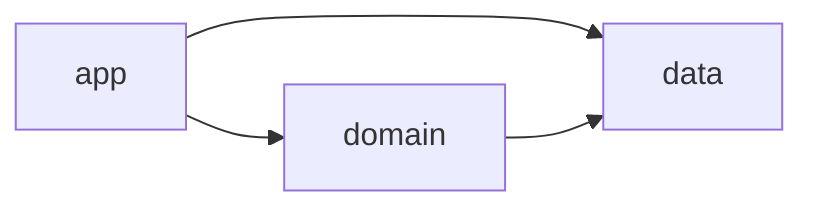
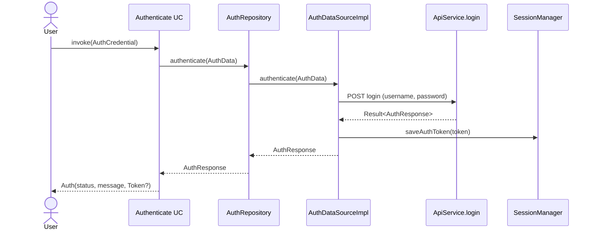
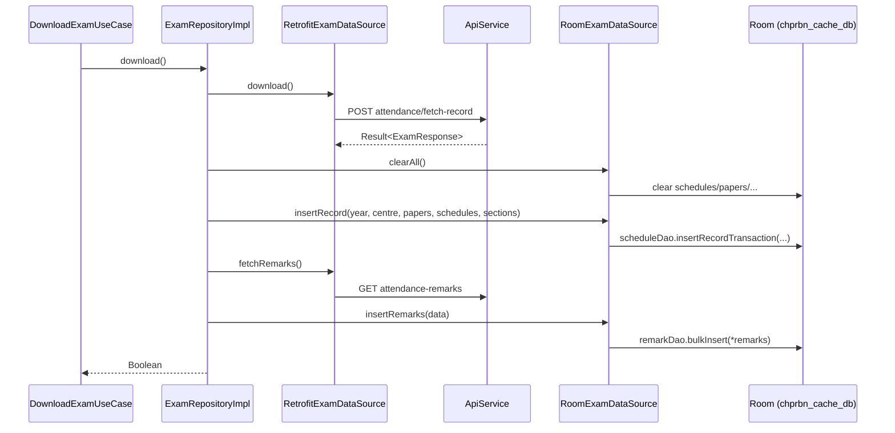
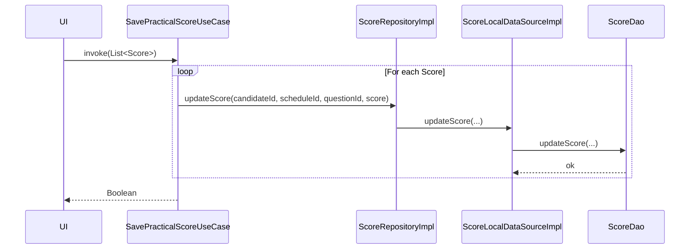
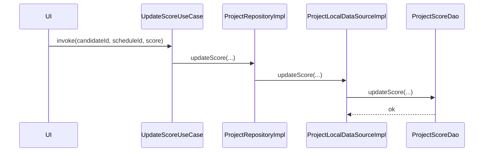

# `data` and `domain` Modules — Reference

Reference documentation for the `data` and `domain` Gradle modules of the CHPRBN mobile examiner app. All paths are relative to the repository root `c:\Users\HP\Projects\Kotlin\chprbn_old`.

---

## 1. Overview

CHPRBN Mobile is the Community Health Practitioners Registration Board of Nigeria examiner app. Examiners use it to download a centre's exam schedule, mark candidate attendance, capture practical scores against question banks, capture project scores, and push the captured records back to the CHPRBN server. The app supports offline operation: an authentication token is cached locally for 12 hours, exam data is hydrated from the network into a Room database, and score/attendance edits are stored locally with a `synced` flag until a push succeeds.

The codebase is split across three Gradle modules:

- `app` — Android application module (presentation layer, ViewModels, navigation, resources).
- `domain` — Kotlin/Android library hosting domain models, use cases, mappers, and `DomainModule` (Hilt providers for use cases and mappers).
- `data` — Kotlin/Android library hosting Retrofit `ApiService`, Room `AppDatabase`, DAOs, entities, repository interfaces and implementations, local/remote data sources, network interceptors, and `DataModule` (the central Hilt module).

### Module dependency graph



`app` depends on both `domain` and `data`. `domain` additionally depends on `data` (declared at [domain/build.gradle.kts](domain/build.gradle.kts) line 45 as `implementation(project(mapOf("path" to ":data")))`); domain mappers, use cases and `DomainModule` import Room entities, Retrofit DTOs, and repository interfaces directly from the data module.

### Gradle configuration

| Module | Build file | Namespace | Plugins |
| --- | --- | --- | --- |
| `data` | [data/build.gradle](data/build.gradle) | `Application.id` = `ng.com.chprbn.mobile` | `com.android.library`, `org.jetbrains.kotlin.android`, `kotlin-android`, `kotlin-kapt`, `dagger.hilt.android.plugin` |
| `domain` | [domain/build.gradle.kts](domain/build.gradle.kts) | `Application.id` = `ng.com.chprbn.mobile` | `com.android.library`, `org.jetbrains.kotlin.android`, `kotlin-android`, `kotlin-kapt` |

Both library modules share the same namespace `ng.com.chprbn.mobile`. SDK levels come from [buildSrc/src/main/java/dependencies/Versions.kt](buildSrc/src/main/java/dependencies/Versions.kt):

| Setting | Value |
| --- | --- |
| `compileSdk` | 34 |
| `minSdk` | 24 |
| `targetSdk` | 34 |
| `sourceCompatibility` / `targetCompatibility` | `JavaVersion.VERSION_17` (`Java.java_version = "17"`) |
| `jvmTarget` | `"17"` |

Constants `Application.id`, `Application.domain_id` (`ng.com.chprbn.domain`), `Application.data_id` (`ng.com.chprbn.data`), `Application.version_code` and `Application.version_name` are declared in [buildSrc/src/main/java/dependencies/Application.kt](buildSrc/src/main/java/dependencies/Application.kt). Library versions are tracked in [buildSrc/src/main/java/dependencies/Versions.kt](buildSrc/src/main/java/dependencies/Versions.kt) and resolved through artifact coordinates in [buildSrc/src/main/java/dependencies/Dependencies.kt](buildSrc/src/main/java/dependencies/Dependencies.kt).

Notable libraries pulled in by `data/build.gradle`:

| Group | Artifacts (constant in `Dependencies.kt`) | Version |
| --- | --- | --- |
| AndroidX core | `core-ktx` (`ktx`) | 1.13.1 |
| OkHttp | `okhttp` | 4.12.0 |
| Retrofit | `retrofit`, `converter-scalars`, `converter-gson` | 2.9.0 |
| Gson | `gson` | 2.10.1 |
| Hilt | `hilt-android`, `hilt-compiler` (kapt) | 2.44.2 |
| Room | `room-ktx`, `room-compiler` (kapt), `room-testing` | 2.6.1 |
| Legacy | `legacy-support-v4` | 1.0.0 |

`domain/build.gradle.kts` pulls in only `core-ktx`, Hilt, the `:data` project and the JUnit/Espresso test artefacts. Coroutines are inherited transitively through the Room/Retrofit stack (`suspend` functions are used pervasively).

`AndroidManifest.xml` files:

- [data/src/main/AndroidManifest.xml](data/src/main/AndroidManifest.xml) declares `<uses-permission android:name="android.permission.ACCESS_NETWORK_STATE" />`.
- [domain/src/main/AndroidManifest.xml](domain/src/main/AndroidManifest.xml) declares no permissions and no application elements.

---

## 2. Domain Module

### 2.1 Package structure

```
domain/src/main/java/ng/com/chprbn/mobile/
├── di/
│   └── DomainModule.kt
├── mapper/
│   ├── assessment/
│   │   ├── AreaMapper.kt
│   │   ├── AssessmentMapper.kt
│   │   ├── CategoryMapper.kt
│   │   └── ItemMapper.kt
│   ├── common/
│   │   ├── RecordMapper.kt
│   │   ├── ScheduleMapper.kt
│   │   ├── StudentAttendanceMapper.kt
│   │   └── StudentEntityMapper.kt
│   ├── misc/
│   │   └── MiscMapper.kt
│   ├── practical/
│   │   └── PracticalMapper.kt
│   └── user/
│       └── AuthMapper.kt
├── model/
│   ├── Assessment.kt
│   ├── AuthCredential.kt
│   ├── Record.kt
│   ├── Student.kt
│   ├── StudentAttendance.kt
│   ├── User.kt
│   ├── assessment/
│   │   ├── Category.kt
│   │   ├── FormItem.kt
│   │   ├── FormSubItem.kt
│   │   └── ThematicArea.kt
│   ├── common/
│   │   ├── Centre.kt
│   │   ├── Paper.kt
│   │   └── Schedule.kt
│   ├── misc/
│   │   ├── Cadre.kt
│   │   ├── ExamHeader.kt
│   │   └── Institution.kt
│   ├── practical/
│   │   ├── Candidate.kt
│   │   ├── Question.kt
│   │   ├── Score.kt
│   │   └── Section.kt
│   └── response/
│       ├── Auth.kt
│       ├── CadreResponse.kt
│       ├── InstitutionResponse.kt
│       ├── Response.kt
│       ├── Token.kt
│       └── UserResponse.kt
└── usecase/
    ├── ClearAllUseCase.kt
    ├── assessment/    (12 use cases)
    ├── attendance/    (8 + student/{4})
    ├── auth/          (Authenticate, Logout, VerifyLoggedInUseCase)
    ├── common/        (GetPaperUseCase, GetPapersUseCase, GetScheduleUseCase, GetSchedulesUseCase)
    ├── misc/          (GetCadre/Cadres/Institution/Institutions UseCase)
    ├── practical/     (7 use cases)
    ├── project/       (3 use cases)
    └── user/          (CheckDataAvailability/FetchCentre/FetchUser UseCase)
```

### 2.2 Domain models

| File | Class | Key fields | Used by |
| --- | --- | --- | --- |
| [domain/src/main/java/ng/com/chprbn/mobile/model/Assessment.kt](domain/src/main/java/ng/com/chprbn/mobile/model/Assessment.kt) | `Assessment` | `id`, `itemId`, `institutionId`, `score` | `AssessmentMapper`, assessment use cases |
| [domain/src/main/java/ng/com/chprbn/mobile/model/AuthCredential.kt](domain/src/main/java/ng/com/chprbn/mobile/model/AuthCredential.kt) | `AuthCredential` | `var username: String`, `var password: String` | `Authenticate` use case |
| [domain/src/main/java/ng/com/chprbn/mobile/model/Record.kt](domain/src/main/java/ng/com/chprbn/mobile/model/Record.kt) | `Record` | `id`, `exam_number`, `full_name`, `sign_in`, `sign_out`, `remark`, `photo` | `RecordMapper`, `GetAttendanceRecordUseCase` |
| [domain/src/main/java/ng/com/chprbn/mobile/model/Student.kt](domain/src/main/java/ng/com/chprbn/mobile/model/Student.kt) | `Student` + `photo(): Bitmap?` | `id`, `examNumber`, `fullName`, `photo` (Base64 string), `signIn`, `signOut`, `remark`, `score` | `StudentEntityMapper`, student/practical/project use cases |
| [domain/src/main/java/ng/com/chprbn/mobile/model/StudentAttendance.kt](domain/src/main/java/ng/com/chprbn/mobile/model/StudentAttendance.kt) | `StudentAttendance` | `id`, `studentId`, `attendanceId`, `signInt`, `signOut`, `remark` | `StudentAttendanceMapper` |
| [domain/src/main/java/ng/com/chprbn/mobile/model/User.kt](domain/src/main/java/ng/com/chprbn/mobile/model/User.kt) | `User` + `photo(): Bitmap` | `fullname`, `phone`, `email`, `permissions`, `photo` | `AuthMapper`, `FetchUserUseCase` |
| [domain/src/main/java/ng/com/chprbn/mobile/model/assessment/Category.kt](domain/src/main/java/ng/com/chprbn/mobile/model/assessment/Category.kt) | `Category` | `id`, `assessmentAreaId`, `name` | `CategoryMapper`, `GetCategoriesUseCase` |
| [domain/src/main/java/ng/com/chprbn/mobile/model/assessment/FormItem.kt](domain/src/main/java/ng/com/chprbn/mobile/model/assessment/FormItem.kt) | `FormItem` | `id`, `assessmentCategoryId`, `name`, `mark`, `var score`, `isMultiChoice`, `hasSubs`, `assessmentId` | `ItemMapper`, `GetFormItemsUseCase` |
| [domain/src/main/java/ng/com/chprbn/mobile/model/assessment/FormSubItem.kt](domain/src/main/java/ng/com/chprbn/mobile/model/assessment/FormSubItem.kt) | `FormSubItem` | `id`, `itemId`, `name`, `mark`, `score`, `assessmentId` | `ItemMapper`, `GetFormSubItemsUseCase` |
| [domain/src/main/java/ng/com/chprbn/mobile/model/assessment/ThematicArea.kt](domain/src/main/java/ng/com/chprbn/mobile/model/assessment/ThematicArea.kt) | `ThematicArea` | `id`, `name` | `AreaMapper`, `GetThematicArea(s)UseCase` |
| [domain/src/main/java/ng/com/chprbn/mobile/model/common/Centre.kt](domain/src/main/java/ng/com/chprbn/mobile/model/common/Centre.kt) | `Centre` | `id`, `name`, `location`, `status` | `RecordMapper`, `FetchCentreUseCase` |
| [domain/src/main/java/ng/com/chprbn/mobile/model/common/Paper.kt](domain/src/main/java/ng/com/chprbn/mobile/model/common/Paper.kt) | `Paper` | `id`, `code`, `name` | `ScheduleMapper`, `GetPapersUseCase` |
| [domain/src/main/java/ng/com/chprbn/mobile/model/common/Schedule.kt](domain/src/main/java/ng/com/chprbn/mobile/model/common/Schedule.kt) | `Schedule` | `id`, `paperId`, `centerName`, `location`, `examDate`, `examCode`, `examType`, `var studentCount`, `var scriptCount` | `ScheduleMapper`, schedule use cases |
| [domain/src/main/java/ng/com/chprbn/mobile/model/misc/Cadre.kt](domain/src/main/java/ng/com/chprbn/mobile/model/misc/Cadre.kt) | `Cadre` | `code`, `description`, `duration`, `id: Int`, `name` | `MiscMapper`, `GetCadresUseCase` |
| [domain/src/main/java/ng/com/chprbn/mobile/model/misc/ExamHeader.kt](domain/src/main/java/ng/com/chprbn/mobile/model/misc/ExamHeader.kt) | `ExamHeader` | `var institution`, `var cadre`, `var paper`, `var year` | `ScheduleMapper` (`ExamHeader → ExamHeaderData`) |
| [domain/src/main/java/ng/com/chprbn/mobile/model/misc/Institution.kt](domain/src/main/java/ng/com/chprbn/mobile/model/misc/Institution.kt) | `Institution` | `id`, `name`, `code`, `phone`, `exam_date`, `institution_id` | `MiscMapper`, `GetInstitution(s)UseCase` |
| [domain/src/main/java/ng/com/chprbn/mobile/model/practical/Candidate.kt](domain/src/main/java/ng/com/chprbn/mobile/model/practical/Candidate.kt) | `Candidate` | `candidateId`, `examNumber`, `fullname`, `photo` | `PracticalMapper`, `GetPracticalCandidatesUseCase` |
| [domain/src/main/java/ng/com/chprbn/mobile/model/practical/Question.kt](domain/src/main/java/ng/com/chprbn/mobile/model/practical/Question.kt) | `Question` (class) | `id`, `sectionId`, `name`, `mark`, `var score` | `PracticalMapper`, `GetPracticalQuestionsUseCase` |
| [domain/src/main/java/ng/com/chprbn/mobile/model/practical/Score.kt](domain/src/main/java/ng/com/chprbn/mobile/model/practical/Score.kt) | `Score` | `id`, `scheduleId`, `candidateId`, `questionId`, `var score`, `var remark` | `SavePracticalScoreUseCase` |
| [domain/src/main/java/ng/com/chprbn/mobile/model/practical/Section.kt](domain/src/main/java/ng/com/chprbn/mobile/model/practical/Section.kt) | `Section` | `id`, `title` | `PracticalMapper`, `GetExamSectionsUseCase` |

Representative model with Android-side helper, [domain/src/main/java/ng/com/chprbn/mobile/model/Student.kt](domain/src/main/java/ng/com/chprbn/mobile/model/Student.kt):

```kotlin
data class Student(
    val id: Long,
    val examNumber: String,
    val fullName: String,
    val photo: String,
    val signIn: Int = 0,
    val signOut: Int = 0,
    val remark: String = "",
    val score: Double = 0.0
) {
    fun photo(): Bitmap? { /* Base64.decode + BitmapFactory.decodeByteArray */ }
}
```

#### Response envelopes (in `model/response/`)

These data classes are returned from use cases and wrap the status/message/payload triple sent by the server.

| File | Class | Shape |
| --- | --- | --- |
| [domain/src/main/java/ng/com/chprbn/mobile/model/response/Auth.kt](domain/src/main/java/ng/com/chprbn/mobile/model/response/Auth.kt) | `Auth` | `(status: Boolean, message: String, data: Token?)` |
| [domain/src/main/java/ng/com/chprbn/mobile/model/response/Token.kt](domain/src/main/java/ng/com/chprbn/mobile/model/response/Token.kt) | `Token` | `(token: String)` |
| [domain/src/main/java/ng/com/chprbn/mobile/model/response/CadreResponse.kt](domain/src/main/java/ng/com/chprbn/mobile/model/response/CadreResponse.kt) | `CadreResponse` | `(status, message, data: List<Cadre>)` |
| [domain/src/main/java/ng/com/chprbn/mobile/model/response/InstitutionResponse.kt](domain/src/main/java/ng/com/chprbn/mobile/model/response/InstitutionResponse.kt) | `InstitutionResponse` | `(status, message, data: List<Institution>)` |
| [domain/src/main/java/ng/com/chprbn/mobile/model/response/Response.kt](domain/src/main/java/ng/com/chprbn/mobile/model/response/Response.kt) | `Response` | `(status, message, data: List<Any>)` |
| [domain/src/main/java/ng/com/chprbn/mobile/model/response/UserResponse.kt](domain/src/main/java/ng/com/chprbn/mobile/model/response/UserResponse.kt) | `UserResponse` | `(status, message, data: User?)` |

### 2.3 Repository contracts

All repository interfaces live in the `data` module (under `ng.com.chprbn.mobile.repository.*`); the domain module imports them. Their methods return Room `*Entity` types or data-layer DTOs in most cases.

#### `AuthRepository` — [data/src/main/java/ng/com/chprbn/mobile/repository/user/AuthRepository.kt](data/src/main/java/ng/com/chprbn/mobile/repository/user/AuthRepository.kt)

| Method | Returns |
| --- | --- |
| `suspend fun isDataPulled()` | `Boolean` |
| `suspend fun authenticate(data: AuthData)` | `AuthResponse` |
| `suspend fun user()` | `FetchResponse` |
| `suspend fun centre()` | `CentreResponse` |
| `suspend fun verifyLoggedIn()` | `Boolean` |
| `suspend fun logout()` | `Boolean` |

#### `AreaRepository` — [data/src/main/java/ng/com/chprbn/mobile/repository/assessment/AreaRepository.kt](data/src/main/java/ng/com/chprbn/mobile/repository/assessment/AreaRepository.kt)

| Method | Returns |
| --- | --- |
| `suspend fun areas()` | `List<AreaEntity>` |
| `suspend fun areaBy(areaId: Long)` | `AreaEntity` |

#### `AssessmentRepository` — [data/src/main/java/ng/com/chprbn/mobile/repository/assessment/AssessmentRepository.kt](data/src/main/java/ng/com/chprbn/mobile/repository/assessment/AssessmentRepository.kt)

| Method | Returns |
| --- | --- |
| `suspend fun download()` | `Boolean` |
| `suspend fun synchronize()` | `Boolean` |
| `suspend fun getAll()` | `List<AssessmentEntity>` |
| `suspend fun byId(id: Long)` | `AssessmentEntity` |
| `suspend fun insert(assessmentEntity: AssessmentEntity)` | `Unit` |
| `suspend fun updateScore(institutionId, assessmentId, score: Double)` | `Unit` |
| `suspend fun delete(assessmentEntity: AssessmentEntity)` | `Unit` |
| `suspend fun clearAll()` | `Unit` |

#### `CategoryRepository` — [data/src/main/java/ng/com/chprbn/mobile/repository/assessment/CategoryRepository.kt](data/src/main/java/ng/com/chprbn/mobile/repository/assessment/CategoryRepository.kt)

| Method | Returns |
| --- | --- |
| `suspend fun categories(areaId: Long)` | `List<CategoryEntity>` |
| `suspend fun categoryBy(categoryId: Long)` | `CategoryEntity` |

#### `ItemRepository` — [data/src/main/java/ng/com/chprbn/mobile/repository/assessment/ItemRepository.kt](data/src/main/java/ng/com/chprbn/mobile/repository/assessment/ItemRepository.kt)

| Method | Returns |
| --- | --- |
| `suspend fun itemsBy(institutionId, categoryId)` | `List<ItemEntity>` |
| `suspend fun subItemsBy(institutionId, itemId)` | `List<SubItemEntity>` |

#### `ExamRepository` — [data/src/main/java/ng/com/chprbn/mobile/repository/common/ExamRepository.kt](data/src/main/java/ng/com/chprbn/mobile/repository/common/ExamRepository.kt)

| Method | Returns |
| --- | --- |
| `suspend fun download()` | `Boolean` |
| `suspend fun schedules()` | `List<ScheduleEntity>` |
| `suspend fun papersBy(code, scheduleId)` | `List<PaperEntity>` |
| `suspend fun scheduleBy(id, paperId)` | `ScheduleEntity` |
| `suspend fun pushRecord(scheduleId, paperId, code)` | `String` |
| `suspend fun studentAttendances(attendanceId)` | `List<DataRecord>` |
| `suspend fun shouldPush(scheduleId, paperId, code)` | `Boolean` |
| `suspend fun canClearRecordFor(examId)` | `Boolean` |
| `suspend fun attendanceCountFor(institutionId, examId, code)` | `String` |
| `suspend fun remarks()` | `List<String>` |
| `suspend fun submit(remark, examId, studentId)` | `Unit` |
| `suspend fun insert(attendance: ScheduleEntity)` | `Unit` |
| `suspend fun update(attendance: ScheduleEntity)` | `Unit` |
| `suspend fun remove(examId)` | `Unit` |
| `suspend fun clearAll()` | `Unit` |

#### `MiscRepository` — [data/src/main/java/ng/com/chprbn/mobile/repository/misc/MiscRepository.kt](data/src/main/java/ng/com/chprbn/mobile/repository/misc/MiscRepository.kt)

| Method | Returns |
| --- | --- |
| `suspend fun institutions()` | `List<InstitutionEntity>` |
| `suspend fun institution(id)` | `InstitutionEntity` |
| `suspend fun cadres()` | `List<CadreData>` |
| `suspend fun cadre(id)` | `BaseResponse` |
| `suspend fun papers()` | `List<PaperData>` |
| `suspend fun paper(code)` | `BaseResponse` |
| `suspend fun clearAll()` | `Unit` |

#### `QuestionRepository` — [data/src/main/java/ng/com/chprbn/mobile/repository/practical/QuestionRepository.kt](data/src/main/java/ng/com/chprbn/mobile/repository/practical/QuestionRepository.kt)

| Method | Returns |
| --- | --- |
| `suspend fun questionsBy(candidateId, sectionId)` | `List<QuestionEntity>` |

#### `ScoreRepository` — [data/src/main/java/ng/com/chprbn/mobile/repository/practical/ScoreRepository.kt](data/src/main/java/ng/com/chprbn/mobile/repository/practical/ScoreRepository.kt)

| Method | Returns |
| --- | --- |
| `suspend fun download()` | `Boolean` |
| `suspend fun synchronize()` | `String` |
| `suspend fun candidates(scheduleId)` | `List<StudentEntity>` |
| `suspend fun insertRecords(institutions, students, sections, questions, scores)` | `Unit` |
| `suspend fun updateScore(candidateId, institutionId, questionId, score: Int)` | `Unit` |
| `suspend fun updateRemark(candidateId, institutionId, questionId, remark)` | `Unit` |
| `suspend fun clearAll()` | `Unit` |

#### `SectionRepository` — [data/src/main/java/ng/com/chprbn/mobile/repository/practical/SectionRepository.kt](data/src/main/java/ng/com/chprbn/mobile/repository/practical/SectionRepository.kt)

| Method | Returns |
| --- | --- |
| `suspend fun sections()` | `List<SectionEntity>` |
| `suspend fun sectionBy(id)` | `SectionEntity` |

#### `ProjectRepository` — [data/src/main/java/ng/com/chprbn/mobile/repository/project/ProjectRepository.kt](data/src/main/java/ng/com/chprbn/mobile/repository/project/ProjectRepository.kt)

| Method | Returns |
| --- | --- |
| `suspend fun candidates(scheduleId)` | `List<StudentEntity>` |
| `suspend fun updateScore(candidateId, scheduleId, score: Double)` | `Unit` |
| `suspend fun pushScores(scheduleId)` | `String` |
| `suspend fun markedScores(scheduleId)` | `List<ProjectScoreEntity>` |
| `suspend fun markSynced(ids: List<Long>)` | `Unit` |

#### `StudentRepository` — [data/src/main/java/ng/com/chprbn/mobile/repository/student/StudentRepository.kt](data/src/main/java/ng/com/chprbn/mobile/repository/student/StudentRepository.kt)

| Method | Returns |
| --- | --- |
| `suspend fun studentsBy(scheduleId, paperId)` | `List<DataRecord>` |
| `suspend fun search(scheduleId, paperId, code, indexing)` | `StudentEntity?` |
| `suspend fun markPresent(examId, studentId)` | `Boolean` |
| `suspend fun insert(student: StudentEntity)` | `Unit` |
| `suspend fun insertMany(students: List<StudentEntity>)` | `Unit` |
| `suspend fun update(student: StudentEntity)` | `Unit` |
| `suspend fun clearAll()` | `Unit` |

### 2.4 Use cases

Use cases live under `domain/src/main/java/ng/com/chprbn/mobile/usecase/`. Each one is a class with a single `suspend operator fun invoke(...)`. Hilt singletons are produced via `DomainModule`.

#### Auth

| Use case | Input | Output | Repositories | Notes |
| --- | --- | --- | --- | --- |
| [Authenticate](domain/src/main/java/ng/com/chprbn/mobile/usecase/auth/Authenticate.kt) | `AuthCredential` | `Auth` | `AuthRepository` (+ `AuthMapper`) | Calls `mapper.mapToAuth(repository.authenticate(mapper.mapToData(credential)))`. |
| [Logout](domain/src/main/java/ng/com/chprbn/mobile/usecase/auth/Logout.kt) | — | `Boolean` | `AuthRepository` | Calls `repository.logout()`. |
| [VerifyLoggedInUseCase](domain/src/main/java/ng/com/chprbn/mobile/usecase/auth/VerifyLoggedInUseCase.kt) | — | `Boolean` | `AuthRepository` | Delegates to `repository.verifyLoggedIn()`. |

#### User

| Use case | Input | Output | Repositories | Notes |
| --- | --- | --- | --- | --- |
| [FetchUserUseCase](domain/src/main/java/ng/com/chprbn/mobile/usecase/user/FetchUserUseCase.kt) | — | `UserResponse` | `AuthRepository` (+ `AuthMapper`) | Maps `FetchResponse → UserResponse`. |
| [FetchCentreUseCase](domain/src/main/java/ng/com/chprbn/mobile/usecase/user/FetchCentreUseCase.kt) | — | `Centre` | `AuthRepository` (+ `RecordMapper`) | Returns `repository.centre().data!!` mapped to `Centre`. |
| [CheckDataAvailabilityUseCase](domain/src/main/java/ng/com/chprbn/mobile/usecase/user/CheckDataAvailabilityUseCase.kt) | — | `Boolean` | `AuthRepository` | Calls `repository.isDataPulled()` (verifies papers/schedules/students counts). |

#### Exam / attendance (common + attendance)

| Use case | Input | Output | Repositories | Notes |
| --- | --- | --- | --- | --- |
| [DownloadExamUseCase](domain/src/main/java/ng/com/chprbn/mobile/usecase/attendance/DownloadExamUseCase.kt) | — | `Boolean` | `ExamRepository` | Constructor takes `ScheduleMapper`; `invoke` only calls `repository.download()`. |
| [GetSchedulesUseCase](domain/src/main/java/ng/com/chprbn/mobile/usecase/common/GetSchedulesUseCase.kt) | — | `List<Schedule>` | `ExamRepository` (+ `ScheduleMapper`) | Maps each entity. |
| [GetScheduleUseCase](domain/src/main/java/ng/com/chprbn/mobile/usecase/common/GetScheduleUseCase.kt) | `id, paperId` | `Schedule` | `ExamRepository` (+ `ScheduleMapper`) | — |
| [GetPapersUseCase](domain/src/main/java/ng/com/chprbn/mobile/usecase/common/GetPapersUseCase.kt) | `code, scheduleId` | `List<Paper>` | `ExamRepository` (+ `ScheduleMapper`) | — |
| [GetPaperUseCase](domain/src/main/java/ng/com/chprbn/mobile/usecase/common/GetPaperUseCase.kt) | `code: String` | `Response` | `MiscRepository` (+ `MiscMapper`) | Wraps `BaseResponse` from the network. |
| [HasAttendanceUseCase](domain/src/main/java/ng/com/chprbn/mobile/usecase/attendance/HasAttendanceUseCase.kt) | `scheduleId, paperId, code` | `Boolean` | `ExamRepository` | Delegates to `repository.shouldPush(...)`. |
| [MarkPresentUseCase](domain/src/main/java/ng/com/chprbn/mobile/usecase/attendance/MarkPresentUseCase.kt) | `examId, studentId` | `Boolean` | `StudentRepository` | Toggles attendance row. |
| [PushMarkedAttendanceUseCase](domain/src/main/java/ng/com/chprbn/mobile/usecase/attendance/PushMarkedAttendanceUseCase.kt) | `scheduleId, paperId, code` | `String` | `ExamRepository` | Returns the server message. |
| [AddRemarkUseCase](domain/src/main/java/ng/com/chprbn/mobile/usecase/attendance/student/AddRemarkUseCase.kt) | `remark, examId, studentId` | `Boolean` (always `true`) | `ExamRepository` | Always returns `true` after `repository.submit(...)`. |
| [GetRemarksUseCase](domain/src/main/java/ng/com/chprbn/mobile/usecase/attendance/GetRemarksUseCase.kt) | — | `List<String>` | `ExamRepository` | — |
| [GetMarkedAttendanceCountUseCase](domain/src/main/java/ng/com/chprbn/mobile/usecase/attendance/GetMarkedAttendanceCountUseCase.kt) | `institutionId, examId, code` | `String` | `ExamRepository` | Returns formatted string `"n of m"`. |
| [ClearAttendanceUseCase](domain/src/main/java/ng/com/chprbn/mobile/usecase/attendance/ClearAttendanceUseCase.kt) | `examId` | `Unit` | `ExamRepository` | Calls `repository.remove(examId)`. |
| [GetAttendanceRecordUseCase](domain/src/main/java/ng/com/chprbn/mobile/usecase/attendance/GetAttendanceRecordUseCase.kt) | `attendanceId` | `List<Record>` | `ExamRepository` (+ `RecordMapper`) | Class exists; not declared in `DomainModule`. |

#### Student

| Use case | Input | Output | Repositories | Notes |
| --- | --- | --- | --- | --- |
| [GetStudentsUseCase](domain/src/main/java/ng/com/chprbn/mobile/usecase/attendance/student/GetStudentsUseCase.kt) | `scheduleId, paperId` | `List<Student>` | `StudentRepository` (+ `StudentEntityMapper`) | Maps `DataRecord → Student`. |
| [SearchStudentUseCase](domain/src/main/java/ng/com/chprbn/mobile/usecase/attendance/student/SearchStudentUseCase.kt) | `scheduleId, paperId, code, indexing` | `Student?` | `StudentRepository` (+ `StudentEntityMapper`) | Imports `entity.common.StudentEntity` directly to call the mapper. |

#### Assessment

| Use case | Input | Output | Repositories | Notes |
| --- | --- | --- | --- | --- |
| [DownloadAssessmentUseCase](domain/src/main/java/ng/com/chprbn/mobile/usecase/assessment/DownloadAssessmentUseCase.kt) | — | `Boolean` | `AssessmentRepository` | — |
| [ClearAllAssessmentUseCase](domain/src/main/java/ng/com/chprbn/mobile/usecase/assessment/ClearAllAssessmentUseCase.kt) | — | `Unit` | `AssessmentRepository` | — |
| [GetAllAssessmentsUseCase](domain/src/main/java/ng/com/chprbn/mobile/usecase/assessment/GetAllAssessmentsUseCase.kt) | — | `List<Assessment>` | `AssessmentRepository` (+ `AssessmentMapper`) | Repository impl returns `emptyList()`. |
| [GetAssessmentUseCase](domain/src/main/java/ng/com/chprbn/mobile/usecase/assessment/GetAssessmentUseCase.kt) | `id: Long` | `Assessment` | `AssessmentRepository` (+ `AssessmentMapper`) | — |
| [GetThematicAreasUseCase](domain/src/main/java/ng/com/chprbn/mobile/usecase/assessment/GetThematicAreasUseCase.kt) | — | `List<ThematicArea>` | `AreaRepository` (+ `AreaMapper`) | — |
| [GetThematicAreaUseCase](domain/src/main/java/ng/com/chprbn/mobile/usecase/assessment/GetThematicAreaUseCase.kt) | `areaId: Long` | `ThematicArea` | `AreaRepository` (+ `AreaMapper`) | — |
| [GetCategoriesUseCase](domain/src/main/java/ng/com/chprbn/mobile/usecase/assessment/GetCategoriesUseCase.kt) | `areaId: Long` | `List<Category>` | `CategoryRepository` (+ `CategoryMapper`) | — |
| [GetFormItemsUseCase](domain/src/main/java/ng/com/chprbn/mobile/usecase/assessment/GetFormItemsUseCase.kt) | `institutionId, categoryId` | `List<FormItem>` | `ItemRepository` (+ `ItemMapper`) | — |
| [GetFormSubItemsUseCase](domain/src/main/java/ng/com/chprbn/mobile/usecase/assessment/GetFormSubItemsUseCase.kt) | `institutionId, itemId` | `List<FormSubItem>` | `ItemRepository` (+ `ItemMapper`) | — |
| [SaveAssessmentsUseCase](domain/src/main/java/ng/com/chprbn/mobile/usecase/assessment/SaveAssessmentsUseCase.kt) | `List<Assessment>` | `Boolean` | `AssessmentRepository` | Iterates and calls `updateScore` per item inside `try/catch`. |
| [PushAssessmentsUseCase](domain/src/main/java/ng/com/chprbn/mobile/usecase/assessment/PushAssessmentsUseCase.kt) | — | `Boolean` | `AssessmentRepository` | Delegates to `repository.synchronize()`. |
| [CreateAssessmentUseCase](domain/src/main/java/ng/com/chprbn/mobile/usecase/assessment/CreateAssessmentUseCase.kt) | `Assessment` | `Unit` | `AssessmentRepository` (+ `AssessmentMapper`) | Method body is currently commented out; the function returns `Unit`. |
| [DeleteAssessmentUseCase](domain/src/main/java/ng/com/chprbn/mobile/usecase/assessment/DeleteAssessmentUseCase.kt) | `Assessment` | `Unit` | `AssessmentRepository` (+ `AssessmentMapper`) | Method body is currently commented out. |
| [UpdateAssessmentUseCase](domain/src/main/java/ng/com/chprbn/mobile/usecase/assessment/UpdateAssessmentUseCase.kt) | `Assessment` | `Unit` | `AssessmentRepository` (+ `AssessmentMapper`) | Method body is currently commented out. |

#### Misc

| Use case | Input | Output | Repositories | Notes |
| --- | --- | --- | --- | --- |
| [GetCadresUseCase](domain/src/main/java/ng/com/chprbn/mobile/usecase/misc/GetCadresUseCase.kt) | — | `List<Cadre>` | `MiscRepository` (+ `MiscMapper`) | — |
| [GetCadreUseCase](domain/src/main/java/ng/com/chprbn/mobile/usecase/misc/GetCadreUseCase.kt) | `id: Long` | `Response` | `MiscRepository` (+ `MiscMapper`) | — |
| [GetInstitutionsUseCase](domain/src/main/java/ng/com/chprbn/mobile/usecase/misc/GetInstitutionsUseCase.kt) | — | `List<Institution>` | `MiscRepository` (+ `MiscMapper`) | — |
| [GetInstitutionUseCase](domain/src/main/java/ng/com/chprbn/mobile/usecase/misc/GetInstitutionUseCase.kt) | `id: Long` | `Institution` | `MiscRepository` (+ `MiscMapper`) | — |

#### Practical

| Use case | Input | Output | Repositories | Notes |
| --- | --- | --- | --- | --- |
| [GetExamSectionsUseCase](domain/src/main/java/ng/com/chprbn/mobile/usecase/practical/GetExamSectionsUseCase.kt) | — | `List<Section>` | `SectionRepository` (+ `PracticalMapper`) | — |
| [GetPracticalCandidatesUseCase](domain/src/main/java/ng/com/chprbn/mobile/usecase/practical/GetPracticalCandidatesUseCase.kt) | `institutionId: Long` | `List<Candidate>` | `ScoreRepository` (+ `PracticalMapper`) | Parameter name `institutionId` is used to pass scheduleId. |
| [GetPracticalQuestionsUseCase](domain/src/main/java/ng/com/chprbn/mobile/usecase/practical/GetPracticalQuestionsUseCase.kt) | `candidateId, sectionId` | `List<Question>` | `QuestionRepository` (+ `PracticalMapper`) | — |
| [DownloadPracticalDataUseCase](domain/src/main/java/ng/com/chprbn/mobile/usecase/practical/DownloadPracticalDataUseCase.kt) | — | `Boolean` | `ScoreRepository` | Repository impl returns `true` unconditionally. |
| [ClearPracticalDataUseCase](domain/src/main/java/ng/com/chprbn/mobile/usecase/practical/ClearPracticalDataUseCase.kt) | — | `Unit` | `ScoreRepository` | — |
| [SavePracticalScoreUseCase](domain/src/main/java/ng/com/chprbn/mobile/usecase/practical/SavePracticalScoreUseCase.kt) | `List<Score>` | `Boolean` | `ScoreRepository` | Iterates `scores` and calls `updateScore` per item inside `try/catch`. |
| [PushPracticalScoreUseCase](domain/src/main/java/ng/com/chprbn/mobile/usecase/practical/PushPracticalScoreUseCase.kt) | — | `String` | `ScoreRepository` | Forwards to `repository.synchronize()`. |

#### Project

| Use case | Input | Output | Repositories | Notes |
| --- | --- | --- | --- | --- |
| [GetPrStudentsUseCase](domain/src/main/java/ng/com/chprbn/mobile/usecase/project/GetPrStudentsUseCase.kt) | `scheduleId, code` | `List<Student>` | `ProjectRepository`, `ScoreRepository` (+ `StudentEntityMapper`) | Branches on `code == "PA"` — uses `ProjectRepository.candidates`; otherwise `ScoreRepository.candidates`. |
| [UpdateScoreUseCase](domain/src/main/java/ng/com/chprbn/mobile/usecase/project/UpdateScoreUseCase.kt) | `candidateId, scheduleId, score: Double` | `Unit` | `ProjectRepository` | — |
| [PushProjectScoresUseCase](domain/src/main/java/ng/com/chprbn/mobile/usecase/project/PushProjectScoresUseCase.kt) | — | — | `ProjectRepository` | The `invoke` body is currently commented out. |

#### Top-level

| Use case | Input | Output | Repositories | Notes |
| --- | --- | --- | --- | --- |
| [ClearAllUseCase](domain/src/main/java/ng/com/chprbn/mobile/usecase/ClearAllUseCase.kt) | — | `Unit` | `StudentRepository`, `ExamRepository`, `MiscRepository` | Wipes all three repositories sequentially. |

#### Empty/placeholder use case classes

The following files declare an empty class body (`class X {}`) with no `invoke` operator.

| File |
| --- |
| [domain/src/main/java/ng/com/chprbn/mobile/usecase/attendance/UpdateAttendanceUseCase.kt](domain/src/main/java/ng/com/chprbn/mobile/usecase/attendance/UpdateAttendanceUseCase.kt) |
| [domain/src/main/java/ng/com/chprbn/mobile/usecase/attendance/student/ClearStudentsUseCase.kt](domain/src/main/java/ng/com/chprbn/mobile/usecase/attendance/student/ClearStudentsUseCase.kt) |
| [domain/src/main/java/ng/com/chprbn/mobile/usecase/attendance/student/UpdateStudentUseCase.kt](domain/src/main/java/ng/com/chprbn/mobile/usecase/attendance/student/UpdateStudentUseCase.kt) |

### 2.5 Mappers

All mappers live in `domain/src/main/java/ng/com/chprbn/mobile/mapper/` and import types from the data module (`ng.com.chprbn.mobile.entity.*` for Room entities and `ng.com.chprbn.mobile.model.*` for Gson DTOs).

| File | Maps |
| --- | --- |
| [domain/src/main/java/ng/com/chprbn/mobile/mapper/assessment/AreaMapper.kt](domain/src/main/java/ng/com/chprbn/mobile/mapper/assessment/AreaMapper.kt) | `AreaEntity ↔ ThematicArea` |
| [domain/src/main/java/ng/com/chprbn/mobile/mapper/assessment/AssessmentMapper.kt](domain/src/main/java/ng/com/chprbn/mobile/mapper/assessment/AssessmentMapper.kt) | `AssessmentEntity ↔ Assessment` |
| [domain/src/main/java/ng/com/chprbn/mobile/mapper/assessment/CategoryMapper.kt](domain/src/main/java/ng/com/chprbn/mobile/mapper/assessment/CategoryMapper.kt) | `CategoryEntity → Category` |
| [domain/src/main/java/ng/com/chprbn/mobile/mapper/assessment/ItemMapper.kt](domain/src/main/java/ng/com/chprbn/mobile/mapper/assessment/ItemMapper.kt) | `ItemEntity → FormItem`; `SubItemEntity → FormSubItem` |
| [domain/src/main/java/ng/com/chprbn/mobile/mapper/common/RecordMapper.kt](domain/src/main/java/ng/com/chprbn/mobile/mapper/common/RecordMapper.kt) | `DataRecord ↔ Record`; `CentreData → Centre` |
| [domain/src/main/java/ng/com/chprbn/mobile/mapper/common/ScheduleMapper.kt](domain/src/main/java/ng/com/chprbn/mobile/mapper/common/ScheduleMapper.kt) | `ScheduleEntity ↔ Schedule`; `PaperEntity → Paper`; `ExamHeader → ExamHeaderData` |
| [domain/src/main/java/ng/com/chprbn/mobile/mapper/common/StudentAttendanceMapper.kt](domain/src/main/java/ng/com/chprbn/mobile/mapper/common/StudentAttendanceMapper.kt) | `StudentAttendanceEntity → StudentAttendance` |
| [domain/src/main/java/ng/com/chprbn/mobile/mapper/common/StudentEntityMapper.kt](domain/src/main/java/ng/com/chprbn/mobile/mapper/common/StudentEntityMapper.kt) | `StudentEntity ↔ Student`; `DataRecord → Student` |
| [domain/src/main/java/ng/com/chprbn/mobile/mapper/misc/MiscMapper.kt](domain/src/main/java/ng/com/chprbn/mobile/mapper/misc/MiscMapper.kt) | `CadreData → Cadre`; `InstitutionEntity → Institution`; `BaseResponse → Response` |
| [domain/src/main/java/ng/com/chprbn/mobile/mapper/practical/PracticalMapper.kt](domain/src/main/java/ng/com/chprbn/mobile/mapper/practical/PracticalMapper.kt) | `SectionEntity → Section`; `QuestionEntity → Question`; `StudentEntity → Candidate` |
| [domain/src/main/java/ng/com/chprbn/mobile/mapper/user/AuthMapper.kt](domain/src/main/java/ng/com/chprbn/mobile/mapper/user/AuthMapper.kt) | `AuthCredential → AuthData`; `AuthResponse → Auth`; `FetchResponse → UserResponse`; `UserData → User`; `AuthToken → Token` |

Representative mapper, [domain/src/main/java/ng/com/chprbn/mobile/mapper/user/AuthMapper.kt](domain/src/main/java/ng/com/chprbn/mobile/mapper/user/AuthMapper.kt):

```kotlin
class AuthMapper {
    fun mapToData(credential: AuthCredential): AuthData =
        AuthData(username = credential.username, password = credential.password)

    fun mapToAuth(response: AuthResponse): Auth =
        if (!response.status) Auth(status = false, message = response.message, data = null)
        else                  Auth(status = true,  message = response.message, data = mapToToken(response.data!!))

    fun mapToUserResponse(response: FetchResponse): UserResponse = UserResponse(
        status = response.status, message = response.message,
        data = response.data?.let { mapToUser(it) }
    )
}
```

### 2.6 Value objects, validators, exceptions, enums, constants

The domain module declares none. Branching on paper type uses the literal strings `"PA"` (project paper) and `"PE"` (practical paper) — see `GetPrStudentsUseCase`, `StudentRepositoryImpl.search`, `RoomExamDataSource.papersBy`, and `PaperDao.paPapersBy`/`pePapersBy`.

### 2.7 Domain DI — `DomainModule`

[domain/src/main/java/ng/com/chprbn/mobile/di/DomainModule.kt](domain/src/main/java/ng/com/chprbn/mobile/di/DomainModule.kt) is a `@Module @InstallIn(SingletonComponent::class)` class (~443 lines). Every mapper and every use case is provided through a hand-written `@Provides @Singleton` factory. A typical binding:

```kotlin
@Provides @Singleton
fun provideGetCategoriesUseCase(
    repository: CategoryRepository, mapper: CategoryMapper
): GetCategoriesUseCase = GetCategoriesUseCase(repository, mapper)
```

#### Mapper providers

| Provider | Returns |
| --- | --- |
| `provideItemMapper` | `ItemMapper` |
| `provideCategoryMapper` | `CategoryMapper` |
| `provideAreaMapper` | `AreaMapper` |
| `provideAssessmentMapper` | `AssessmentMapper` |
| `provideScheduleMapper` | `ScheduleMapper` |
| `provideStudentAttendanceMapper` | `StudentAttendanceMapper` |
| `provideStudentEntityMapper` | `StudentEntityMapper` |
| `provideRecordMapper` | `RecordMapper` |
| `provideAuthMapper` | `AuthMapper` |
| `provideMiscMapper` | `MiscMapper` |
| `providePracticalMapper` | `PracticalMapper` |

#### Use case providers (selected — every implemented use case is bound here except `GetAttendanceRecordUseCase`)

| Provider | Constructs |
| --- | --- |
| `provideAuthenticateUseCase` | `Authenticate(repository, AuthMapper)` |
| `provideLogoutUseCase` | `Logout(repository)` |
| `provideVerifyLoggedInUseCase` | `VerifyLoggedInUseCase(repository)` |
| `provideFetchUserUseCase` | `FetchUserUseCase(repository, AuthMapper)` |
| `provideFetchCentreUseCase` | `FetchCentreUseCase(repository, RecordMapper)` |
| `provideCheckDataAvailabilityUseCase` | `CheckDataAvailabilityUseCase(repository)` |
| `provideDownloadExamUseCase` | `DownloadExamUseCase(repository, ScheduleMapper)` |
| `provideGetSchedulesUseCase` | `GetSchedulesUseCase(repository, ScheduleMapper)` |
| `provideGetScheduleUseCase` | `GetScheduleUseCase(repository, ScheduleMapper)` |
| `provideGetPapersUseCase` | `GetPapersUseCase(repository, ScheduleMapper)` |
| `provideGetPaperUseCase` | `GetPaperUseCase(miscRepository, MiscMapper)` |
| `provideHasAttendanceUseCase` | `HasAttendanceUseCase(repository)` |
| `provideMarkPresentUseCase` | `MarkPresentUseCase(studentRepository)` |
| `providePushMarkedAttendanceUseCase` | `PushMarkedAttendanceUseCase(repository)` |
| `provideAddRemarkUseCase` | `AddRemarkUseCase(repository)` |
| `provideGetRemarksUseCase` | `GetRemarksUseCase(repository)` |
| `provideGetMarkedAttendanceCountUseCase` | `GetMarkedAttendanceCountUseCase(repository)` |
| `provideClearAttendanceUseCase` | `ClearAttendanceUseCase(repository)` |
| `provideGetStudentsUseCase` | `GetStudentsUseCase(studentRepository, StudentEntityMapper)` |
| `provideSearchStudentUseCase` | `SearchStudentUseCase(studentRepository, StudentEntityMapper)` |
| `provideGetThematicAreasUseCase` | `GetThematicAreasUseCase(areaRepository, AreaMapper)` |
| `provideGetThematicAreaUseCase` | `GetThematicAreaUseCase(areaRepository, AreaMapper)` |
| `provideGetCategoriesUseCase` | `GetCategoriesUseCase(categoryRepository, CategoryMapper)` |
| `provideGetFormItemsUseCase` | `GetFormItemsUseCase(itemRepository, ItemMapper)` |
| `provideGetFormSubItemsUseCase` | `GetFormSubItemsUseCase(itemRepository, ItemMapper)` |
| `provideDownloadAssessmentUseCase` | `DownloadAssessmentUseCase(repository)` |
| `provideClearAllAssessmentUseCase` | `ClearAllAssessmentUseCase(repository)` |
| `provideGetAllAssessmentsUseCase` | `GetAllAssessmentsUseCase(repository, AssessmentMapper)` |
| `provideGetAssessmentUseCase` | `GetAssessmentUseCase(repository, AssessmentMapper)` |
| `provideSaveAssessmentsUseCase` | `SaveAssessmentsUseCase(repository)` |
| `providePushAssessmentsUseCase` | `PushAssessmentsUseCase(repository)` |
| `provideCreateAssessmentUseCase` | `CreateAssessmentUseCase(repository, AssessmentMapper)` |
| `provideDeleteAssessmentUseCase` | `DeleteAssessmentUseCase(repository, AssessmentMapper)` |
| `provideUpdateAssessmentUseCase` | `UpdateAssessmentUseCase(repository, AssessmentMapper)` |
| `provideGetCadresUseCase` | `GetCadresUseCase(repository, MiscMapper)` |
| `provideGetCadreUseCase` | `GetCadreUseCase(repository, MiscMapper)` |
| `provideGetInstitutionsUseCase` | `GetInstitutionsUseCase(repository, MiscMapper)` |
| `provideGetInstitutionUseCase` | `GetInstitutionUseCase(repository, MiscMapper)` |
| `provideGetExamSectionsUseCase` | `GetExamSectionsUseCase(sectionRepository, PracticalMapper)` |
| `provideGetPracticalCandidatesUseCase` | `GetPracticalCandidatesUseCase(scoreRepository, PracticalMapper)` |
| `provideGetPracticalQuestionsUseCase` | `GetPracticalQuestionsUseCase(questionRepository, PracticalMapper)` |
| `provideSavePracticalScoreUseCase` | `SavePracticalScoreUseCase(scoreRepository)` |
| `providePushPracticalScoreUseCase` | `PushPracticalScoreUseCase(scoreRepository)` |
| `provideDownloadPracticalDataUseCase` | `DownloadPracticalDataUseCase(scoreRepository)` |
| `provideClearPracticalDataUseCase` | `ClearPracticalDataUseCase(scoreRepository)` |
| `provideGetPrStudentsUseCase` | `GetPrStudentsUseCase(projectRepository, scoreRepository, StudentEntityMapper)` |
| `provideUpdateScoreUseCase` | `UpdateScoreUseCase(projectRepository)` |
| `provideClearAllUseCase` | `ClearAllUseCase(studentRepository, examRepository, miscRepository)` |

Repository interfaces themselves are not bound here; they are provided by `DataModule` (see §3.11).

---

## 3. Data Module

### 3.1 Package structure

```
data/src/main/java/ng/com/chprbn/mobile/
├── config/
│   └── NetworkConfig.kt
├── datasource/
│   ├── local/
│   │   ├── AppDatabase.kt
│   │   ├── AreaLocalDataSource.kt           + RoomAreaDataSource.kt
│   │   ├── AssessmentLocalDataSource.kt     + RoomAssessmentDataSource.kt
│   │   ├── CategoryLocalDataSource.kt       + RoomCategoryDataSource.kt
│   │   ├── ItemLocalDataSource.kt           + RoomItemLocalDataSource.kt
│   │   ├── MiscLocalDataSource.kt           + RoomMiscLocalDataSource.kt
│   │   ├── common/
│   │   │   ├── ExamLocalDataSource.kt       + RoomExamDataSource.kt
│   │   │   └── StudentLocalDataSource.kt    + RoomStudentDataSource.kt
│   │   ├── dao/
│   │   │   ├── AreaDao.kt, AssessmentDao.kt, CategoryDao.kt,
│   │   │   ├── InstitutionDao.kt, ItemDao.kt, SubItemDao.kt
│   │   │   ├── common/PaperDao.kt, RemarkDao.kt, ScheduleDao.kt,
│   │   │   │         StudentAttendanceDao.kt, StudentDao.kt
│   │   │   ├── practical/QuestionDao.kt, ScoreDao.kt, SectionDao.kt
│   │   │   └── project/ProjectScoreDao.kt
│   │   ├── practical/
│   │   │   ├── QuestionLocalDataSource.kt   + QuestionLocalDataSourceImpl.kt
│   │   │   ├── ScoreLocalDataSource.kt      + ScoreLocalDataSourceImpl.kt
│   │   │   └── SectionLocalDataSource.kt    + SectionLocalDataSourceImpl.kt
│   │   ├── project/
│   │   │   └── ProjectLocalDataSource.kt    + ProjectLocalDataSourceImpl.kt
│   │   └── user/
│   │       └── AuthLocalDataSource.kt       + AuthLocalDataSourceImpl.kt
│   └── remote/
│       ├── assessment/  (interface + RetrofitAssessmentRemoteDataSource)
│       ├── common/      (ExamRemoteDataSource + RetrofitExamDataSource)
│       ├── misc/        (MiscRemoteDataSource + RetrofitMiscDataSource)
│       ├── network/
│       │   ├── ApiService.kt
│       │   ├── AuthInterceptor.kt
│       │   ├── CallResponse.kt
│       │   ├── CallResponseAdapterFactory.kt
│       │   ├── LoggingInterceptor.kt
│       │   ├── NetworkInterceptor.kt
│       │   ├── NetworkStateMonitor.kt
│       │   ├── NetworkUtils.kt
│       │   ├── NoConnectionException.kt
│       │   └── RetryInterceptor.kt
│       ├── practical/   (interface + PracticalRemoteDataSourceImpl)
│       ├── project/     (interface + ProjectRemoteDataSourceImpl)
│       ├── student/     (StudentRemoteDataSource + RetrofitStudentDataSource)
│       └── user/        (AuthDataSource + AuthDataSourceImpl)
├── di/
│   └── DataModule.kt
├── entity/
│   ├── AreaEntity.kt, AssessmentEntity.kt, CategoryEntity.kt,
│   ├── InstitutionEntity.kt, ItemEntity.kt, RemarkEntity.kt, SubItemEntity.kt
│   ├── common/  (PaperEntity, ScheduleEntity, StudentAttendanceEntity, StudentEntity)
│   ├── practical/ (QuestionEntity, ScoreEntity, SectionEntity)
│   └── project/   (ProjectScoreEntity)
├── model/
│   ├── (top-level DTOs)
│   ├── assessment/   (AreaData, AssessmentResponse, AssessmentResult, CategoryData, Data,
│   │                  Institution, ItemData, ResultItem, SubItemData)
│   ├── attendance/   (PushAttendance)
│   ├── common/       (Candidate, CentreData, ExamData, PaperCandidate, ScheduleData, Scores)
│   ├── misc/         (CadreData, InstitutionData, PaperData)
│   ├── practical/    (FetchPracticalResponse, InstitutionScore, Practical, QuestionData,
│   │                  ScoreData, SectionData)
│   └── response/     (AuthResponse, AuthToken, BaseResponse, CadresResponse,
│                      CentreResponse, ExamResponse, FetchResponse, InstResponse,
│                      PapersResponse, PushResponse, RemarksResponse)
├── repository/       (12 *Repository.kt interfaces + 12 *RepositoryImpl.kt)
└── storage/
    ├── Session.kt
    └── SessionManager.kt
```

### 3.2 DTOs and request/response models

Top-level wire-format types live in `data/src/main/java/ng/com/chprbn/mobile/model/`.

| File | Class | Purpose |
| --- | --- | --- |
| [model/AttendanceRecord.kt](data/src/main/java/ng/com/chprbn/mobile/model/AttendanceRecord.kt) | `AttendanceRecord` | Push body record + DAO projection (`StudentAttendanceDao.fetchMarkedAttendanceFor`) |
| [model/AuthData.kt](data/src/main/java/ng/com/chprbn/mobile/model/AuthData.kt) | `AuthData(username, password)` | Login form payload |
| [model/DataRecord.kt](data/src/main/java/ng/com/chprbn/mobile/model/DataRecord.kt) | `DataRecord` | DAO projection used by `StudentDao.studentsBy` and `StudentAttendanceDao.studentFor` |
| [model/ExamHeaderData.kt](data/src/main/java/ng/com/chprbn/mobile/model/ExamHeaderData.kt) | `ExamHeaderData` | Mapped from `ExamHeader` |
| [model/InstitutionData.kt](data/src/main/java/ng/com/chprbn/mobile/model/InstitutionData.kt) | `InstitutionData` | Schedule-flow institution DTO (papers + candidates) |
| [model/PaperData.kt](data/src/main/java/ng/com/chprbn/mobile/model/PaperData.kt) | `PaperData` | Schedule-flow paper DTO |
| [model/UserData.kt](data/src/main/java/ng/com/chprbn/mobile/model/UserData.kt) | `UserData` | Inner `data` payload of `FetchResponse` |
| [model/assessment/AreaData.kt](data/src/main/java/ng/com/chprbn/mobile/model/assessment/AreaData.kt) | `AreaData` | Area + nested categories |
| [model/assessment/AssessmentResponse.kt](data/src/main/java/ng/com/chprbn/mobile/model/assessment/AssessmentResponse.kt) | `AssessmentResponse` | Envelope `(status, message, data: Data?)` |
| [model/assessment/AssessmentResult.kt](data/src/main/java/ng/com/chprbn/mobile/model/assessment/AssessmentResult.kt) | `AssessmentResult` | Push body |
| [model/assessment/CategoryData.kt](data/src/main/java/ng/com/chprbn/mobile/model/assessment/CategoryData.kt) | `CategoryData` | Nested category |
| [model/assessment/Data.kt](data/src/main/java/ng/com/chprbn/mobile/model/assessment/Data.kt) | `Data` | Top-level assessment payload |
| [model/assessment/Institution.kt](data/src/main/java/ng/com/chprbn/mobile/model/assessment/Institution.kt) | `Institution` | Assessment-flow institution |
| [model/assessment/ItemData.kt](data/src/main/java/ng/com/chprbn/mobile/model/assessment/ItemData.kt) | `ItemData` | Item with nested sub_items |
| [model/assessment/ResultItem.kt](data/src/main/java/ng/com/chprbn/mobile/model/assessment/ResultItem.kt) | `ResultItem` | DAO projection (id, score) |
| [model/assessment/SubItemData.kt](data/src/main/java/ng/com/chprbn/mobile/model/assessment/SubItemData.kt) | `SubItemData` | Nested sub item |
| [model/attendance/PushAttendance.kt](data/src/main/java/ng/com/chprbn/mobile/model/attendance/PushAttendance.kt) | `PushAttendance(record: List<AttendanceRecord>)` | Wrapper used inside `ExamRepositoryImpl.pushRecord`; unwrapped before reaching `ApiService` |
| [model/common/Candidate.kt](data/src/main/java/ng/com/chprbn/mobile/model/common/Candidate.kt) | `Candidate` | Schedule candidate DTO |
| [model/common/CentreData.kt](data/src/main/java/ng/com/chprbn/mobile/model/common/CentreData.kt) | `CentreData` | Exam centre DTO |
| [model/common/ExamData.kt](data/src/main/java/ng/com/chprbn/mobile/model/common/ExamData.kt) | `ExamData` | Top-level exam-fetch payload |
| [model/common/PaperCandidate.kt](data/src/main/java/ng/com/chprbn/mobile/model/common/PaperCandidate.kt) | `PaperCandidate` | (paper_id, candidate_id, scheduled_candidate_id) |
| [model/common/ScheduleData.kt](data/src/main/java/ng/com/chprbn/mobile/model/common/ScheduleData.kt) | `ScheduleData` | Schedule + candidates + paper_candidates |
| [model/common/Scores.kt](data/src/main/java/ng/com/chprbn/mobile/model/common/Scores.kt) | `Scores(practicals: List<ScoreEntity>, projects: List<ProjectScoreEntity>)` | Request body for `pushPractical` |
| [model/misc/CadreData.kt](data/src/main/java/ng/com/chprbn/mobile/model/misc/CadreData.kt) | `CadreData` | Cadre DTO |
| [model/misc/InstitutionData.kt](data/src/main/java/ng/com/chprbn/mobile/model/misc/InstitutionData.kt) | `InstitutionData` | Misc-flow institution DTO (different shape from `model/InstitutionData.kt`) |
| [model/misc/PaperData.kt](data/src/main/java/ng/com/chprbn/mobile/model/misc/PaperData.kt) | `PaperData` | Misc-flow paper DTO |
| [model/practical/FetchPracticalResponse.kt](data/src/main/java/ng/com/chprbn/mobile/model/practical/FetchPracticalResponse.kt) | `FetchPracticalResponse` | Envelope |
| [model/practical/InstitutionScore.kt](data/src/main/java/ng/com/chprbn/mobile/model/practical/InstitutionScore.kt) | `InstitutionScore` | Outgoing summarised scores |
| [model/practical/Practical.kt](data/src/main/java/ng/com/chprbn/mobile/model/practical/Practical.kt) | `Practical` | Top-level practical payload |
| [model/practical/QuestionData.kt](data/src/main/java/ng/com/chprbn/mobile/model/practical/QuestionData.kt) | `QuestionData` | Question DTO |
| [model/practical/ScoreData.kt](data/src/main/java/ng/com/chprbn/mobile/model/practical/ScoreData.kt) | `ScoreData` | Single score DTO |
| [model/practical/SectionData.kt](data/src/main/java/ng/com/chprbn/mobile/model/practical/SectionData.kt) | `SectionData` | Section DTO with nested questions |
| [model/response/AuthResponse.kt](data/src/main/java/ng/com/chprbn/mobile/model/response/AuthResponse.kt) | `AuthResponse(var status, var message, var data: AuthToken?)` | Login envelope |
| [model/response/AuthToken.kt](data/src/main/java/ng/com/chprbn/mobile/model/response/AuthToken.kt) | `AuthToken(token: String)` | Inner login payload |
| [model/response/BaseResponse.kt](data/src/main/java/ng/com/chprbn/mobile/model/response/BaseResponse.kt) | `BaseResponse(status, message, data: List<Any>)` | Generic envelope |
| [model/response/CadresResponse.kt](data/src/main/java/ng/com/chprbn/mobile/model/response/CadresResponse.kt) | `CadresResponse` | `data: List<CadreData>` |
| [model/response/CentreResponse.kt](data/src/main/java/ng/com/chprbn/mobile/model/response/CentreResponse.kt) | `CentreResponse` | `data: CentreData?` |
| [model/response/ExamResponse.kt](data/src/main/java/ng/com/chprbn/mobile/model/response/ExamResponse.kt) | `ExamResponse` | `data: ExamData?` |
| [model/response/FetchResponse.kt](data/src/main/java/ng/com/chprbn/mobile/model/response/FetchResponse.kt) | `FetchResponse(var status, var message = "Qwerty", var data: UserData?)` | User-fetch envelope; default message is the literal `"Qwerty"` |
| [model/response/InstResponse.kt](data/src/main/java/ng/com/chprbn/mobile/model/response/InstResponse.kt) | `InstResponse` | `data: List<InstitutionData>` |
| [model/response/PapersResponse.kt](data/src/main/java/ng/com/chprbn/mobile/model/response/PapersResponse.kt) | `PapersResponse` | `data: List<PaperData>` |
| [model/response/PushResponse.kt](data/src/main/java/ng/com/chprbn/mobile/model/response/PushResponse.kt) | `PushResponse(status, message, data: List<Long>)` | Server returns synced ids |
| [model/response/RemarksResponse.kt](data/src/main/java/ng/com/chprbn/mobile/model/response/RemarksResponse.kt) | `RemarksResponse` | `data: List<RemarkEntity>` (Room entity is the response item) |

Representative DTO showing entities used as request body, [model/common/Scores.kt](data/src/main/java/ng/com/chprbn/mobile/model/common/Scores.kt):

```kotlin
data class Scores(val practicals: List<ScoreEntity>, val projects: List<ProjectScoreEntity>)
```

### 3.3 Mappers (in `data`)

The `data` module does not contain its own mapper package; all mapping types live under `domain/.../mapper/` (see §2.5). Some entity construction is inlined inside data-source code, most notably [data/src/main/java/ng/com/chprbn/mobile/datasource/local/common/RoomExamDataSource.kt](data/src/main/java/ng/com/chprbn/mobile/datasource/local/common/RoomExamDataSource.kt) (`insertRecord` translates `ScheduleData` + `PaperData` + `CentreData` + `SectionData` into Room entities before delegating to the transactional `scheduleDao.insertRecordTransaction(...)`).

### 3.4 Repository implementations

| Interface | Implementation | Constructor dependencies | Behaviour summary |
| --- | --- | --- | --- |
| [AreaRepository](data/src/main/java/ng/com/chprbn/mobile/repository/assessment/AreaRepository.kt) | [AreaRepositoryImpl](data/src/main/java/ng/com/chprbn/mobile/repository/assessment/AreaRepositoryImpl.kt) | `AreaLocalDataSource` | Forwards both methods to the local data source. |
| [AssessmentRepository](data/src/main/java/ng/com/chprbn/mobile/repository/assessment/AssessmentRepository.kt) | [AssessmentRepositoryImpl](data/src/main/java/ng/com/chprbn/mobile/repository/assessment/AssessmentRepositoryImpl.kt) | `AssessmentLocalDataSource`, `AssessmentRemoteDataSource` | `download()` fetches via `apiService.assessments()` and writes the parsed `Data` into Room; `synchronize()` pushes via `apiService.pushAssessments(...)`; `getAll()` returns `emptyList()`; other methods delegate to the DAO. |
| [CategoryRepository](data/src/main/java/ng/com/chprbn/mobile/repository/assessment/CategoryRepository.kt) | [CategoryRepositoryImpl](data/src/main/java/ng/com/chprbn/mobile/repository/assessment/CategoryRepositoryImpl.kt) | `CategoryLocalDataSource` | Forwards both methods to the local data source. |
| [ItemRepository](data/src/main/java/ng/com/chprbn/mobile/repository/assessment/ItemRepository.kt) | [ItemRepositoryImpl](data/src/main/java/ng/com/chprbn/mobile/repository/assessment/ItemRepositoryImpl.kt) | `ItemLocalDataSource` | Calls `itemDao.itemsBy` / `subItemDao.subItemsBy` via the local source. |
| [ExamRepository](data/src/main/java/ng/com/chprbn/mobile/repository/common/ExamRepository.kt) | [ExamRepositoryImpl](data/src/main/java/ng/com/chprbn/mobile/repository/common/ExamRepositoryImpl.kt) | `ExamLocalDataSource`, `ExamRemoteDataSource`, `StudentLocalDataSource`, `ProjectLocalDataSource`, `ProjectRemoteDataSource`, `ScoreLocalDataSource`, `PracticalRemoteDataSource` | `download()` calls `remoteDataSource.download()`, on success clears local data and re-inserts the transactional record, then fetches remarks; `pushRecord(scheduleId, paperId, code)` chooses between pushing attendance (when `code` is empty), or pushing combined practical + project `Scores` (any other code), then marks pushed rows synced. A private `isCachedDataValid()` returns `false`. |
| [MiscRepository](data/src/main/java/ng/com/chprbn/mobile/repository/misc/MiscRepository.kt) | [MiscRepositoryImpl](data/src/main/java/ng/com/chprbn/mobile/repository/misc/MiscRepositoryImpl.kt) | `RoomMiscLocalDataSource`, `MiscRemoteDataSource` | `institutions/institution` go through local; `cadres/cadre/papers/paper` hit the network through `MiscRemoteDataSource`. |
| [QuestionRepository](data/src/main/java/ng/com/chprbn/mobile/repository/practical/QuestionRepository.kt) | [QuestionRepositoryImpl](data/src/main/java/ng/com/chprbn/mobile/repository/practical/QuestionRepositoryImpl.kt) | `QuestionLocalDataSource` | Calls `questionDao.questionsBy`. |
| [ScoreRepository](data/src/main/java/ng/com/chprbn/mobile/repository/practical/ScoreRepository.kt) | [ScoreRepositoryImpl](data/src/main/java/ng/com/chprbn/mobile/repository/practical/ScoreRepositoryImpl.kt) | `ScoreLocalDataSource`, `PracticalRemoteDataSource` | `download()` returns `true` unconditionally; `synchronize()` builds a `List<InstitutionScore>` from local data, leaves the remote call commented out, and returns the empty string; `candidates`/`updateScore`/`updateRemark`/`clearAll` forward to the local source. Contains a `seed()` factory for test data that is not invoked. |
| [SectionRepository](data/src/main/java/ng/com/chprbn/mobile/repository/practical/SectionRepository.kt) | [SectionRepositoryImpl](data/src/main/java/ng/com/chprbn/mobile/repository/practical/SectionRepositoryImpl.kt) | `SectionLocalDataSource` | Forwards both methods to the local data source. |
| [ProjectRepository](data/src/main/java/ng/com/chprbn/mobile/repository/project/ProjectRepository.kt) | [ProjectRepositoryImpl](data/src/main/java/ng/com/chprbn/mobile/repository/project/ProjectRepositoryImpl.kt) | `ProjectLocalDataSource`, `ProjectRemoteDataSource` | `candidates`, `updateScore`, `markedScores`, `markSynced` delegate to the local source. `pushScores(scheduleId)` body is currently commented out and returns an empty string. |
| [StudentRepository](data/src/main/java/ng/com/chprbn/mobile/repository/student/StudentRepository.kt) | [StudentRepositoryImpl](data/src/main/java/ng/com/chprbn/mobile/repository/student/StudentRepositoryImpl.kt) | `StudentLocalDataSource`, `ProjectLocalDataSource`, `ScoreLocalDataSource` | `search` branches on `code`: `"PA"` → `projectLocalDataSource.search`, `"PE"` → `scoreLocalDataSource.search`, otherwise `localDataSource.search`. Other methods forward to `StudentLocalDataSource`. |
| [AuthRepository](data/src/main/java/ng/com/chprbn/mobile/repository/user/AuthRepository.kt) | [AuthRepositoryImpl](data/src/main/java/ng/com/chprbn/mobile/repository/user/AuthRepositoryImpl.kt) | `AuthDataSource`, `AuthLocalDataSource` | One-line delegations: remote methods go through `AuthDataSource`; `isDataPulled`/`verifyLoggedIn`/`logout` go through `AuthLocalDataSource`. |

The implementation [AuthRepositoryImpl](data/src/main/java/ng/com/chprbn/mobile/repository/user/AuthRepositoryImpl.kt):

```kotlin
class AuthRepositoryImpl(
    private val dataSource: AuthDataSource,
    private val localDataSource: AuthLocalDataSource
) : AuthRepository {
    override suspend fun isDataPulled(): Boolean = localDataSource.isDataPulled()
    override suspend fun authenticate(data: AuthData): AuthResponse = dataSource.authenticate(data)
    override suspend fun user(): FetchResponse = dataSource.user()
    override suspend fun centre(): CentreResponse = dataSource.centre()
    override suspend fun verifyLoggedIn(): Boolean = localDataSource.verifyLoggedIn()
    override suspend fun logout(): Boolean = localDataSource.logout()
}
```

### 3.5 Local data sources

| Interface | Implementation | DAOs used | Behaviour |
| --- | --- | --- | --- |
| [AreaLocalDataSource](data/src/main/java/ng/com/chprbn/mobile/datasource/local/AreaLocalDataSource.kt) | [RoomAreaDataSource](data/src/main/java/ng/com/chprbn/mobile/datasource/local/RoomAreaDataSource.kt) | `AreaDao` | `areas()` → `dao.areas()`; `areaBy(id)` → `dao.areaBy(id)` |
| [AssessmentLocalDataSource](data/src/main/java/ng/com/chprbn/mobile/datasource/local/AssessmentLocalDataSource.kt) | [RoomAssessmentDataSource](data/src/main/java/ng/com/chprbn/mobile/datasource/local/RoomAssessmentDataSource.kt) | `AssessmentDao` | Wraps every CRUD + clear + transactional insert method on `AssessmentDao`. |
| [CategoryLocalDataSource](data/src/main/java/ng/com/chprbn/mobile/datasource/local/CategoryLocalDataSource.kt) | [RoomCategoryDataSource](data/src/main/java/ng/com/chprbn/mobile/datasource/local/RoomCategoryDataSource.kt) | `CategoryDao` | Forwards the two queries. |
| [ItemLocalDataSource](data/src/main/java/ng/com/chprbn/mobile/datasource/local/ItemLocalDataSource.kt) | [RoomItemLocalDataSource](data/src/main/java/ng/com/chprbn/mobile/datasource/local/RoomItemLocalDataSource.kt) | `ItemDao`, `SubItemDao` | Returns items and sub-items joined with assessment scores. |
| [MiscLocalDataSource](data/src/main/java/ng/com/chprbn/mobile/datasource/local/MiscLocalDataSource.kt) | [RoomMiscLocalDataSource](data/src/main/java/ng/com/chprbn/mobile/datasource/local/RoomMiscLocalDataSource.kt) | `InstitutionDao` | Provides institutions list/by-id and `clearAll`. |
| [ExamLocalDataSource](data/src/main/java/ng/com/chprbn/mobile/datasource/local/common/ExamLocalDataSource.kt) | [RoomExamDataSource](data/src/main/java/ng/com/chprbn/mobile/datasource/local/common/RoomExamDataSource.kt) | `ScheduleDao`, `PaperDao`, `RemarkDao`, `StudentAttendanceDao`, `ScoreDao`, `ProjectScoreDao` | Hosts the most logic. `papersBy(code, scheduleId)` and `shouldPush(scheduleId, paperId, code)` branch on `code` against `"PA"`, `"PE"`, else. `insertRecord(year, centre, papers, schedulesData, practicalSections)` translates network DTOs into all derived Room entities and calls `scheduleDao.insertRecordTransaction(...)`. `clearAll()` clears papers, schedules, students, project_scores, student_attendances, scores and remarks. |
| [StudentLocalDataSource](data/src/main/java/ng/com/chprbn/mobile/datasource/local/common/StudentLocalDataSource.kt) | [RoomStudentDataSource](data/src/main/java/ng/com/chprbn/mobile/datasource/local/common/RoomStudentDataSource.kt) | `StudentDao` | `studentsBy`, `search`, `markPresent`, single + bulk insert/update, clear. |
| [QuestionLocalDataSource](data/src/main/java/ng/com/chprbn/mobile/datasource/local/practical/QuestionLocalDataSource.kt) | [QuestionLocalDataSourceImpl](data/src/main/java/ng/com/chprbn/mobile/datasource/local/practical/QuestionLocalDataSourceImpl.kt) | `QuestionDao` | Returns questions for a candidate + section via a JOIN. |
| [ScoreLocalDataSource](data/src/main/java/ng/com/chprbn/mobile/datasource/local/practical/ScoreLocalDataSource.kt) | [ScoreLocalDataSourceImpl](data/src/main/java/ng/com/chprbn/mobile/datasource/local/practical/ScoreLocalDataSourceImpl.kt) | `ScoreDao` | Score lookups, `candidates` aggregation, `updateScore`/`updateRemark`, search, transactional inserts, clears. |
| [SectionLocalDataSource](data/src/main/java/ng/com/chprbn/mobile/datasource/local/practical/SectionLocalDataSource.kt) | [SectionLocalDataSourceImpl](data/src/main/java/ng/com/chprbn/mobile/datasource/local/practical/SectionLocalDataSourceImpl.kt) | `SectionDao` | Sections list and by id. |
| [ProjectLocalDataSource](data/src/main/java/ng/com/chprbn/mobile/datasource/local/project/ProjectLocalDataSource.kt) | [ProjectLocalDataSourceImpl](data/src/main/java/ng/com/chprbn/mobile/datasource/local/project/ProjectLocalDataSourceImpl.kt) | `ProjectScoreDao` | Candidate list, score lookup, `updateScore`, `markSynced`, search, transactional clear. |
| [AuthLocalDataSource](data/src/main/java/ng/com/chprbn/mobile/datasource/local/user/AuthLocalDataSource.kt) | [AuthLocalDataSourceImpl](data/src/main/java/ng/com/chprbn/mobile/datasource/local/user/AuthLocalDataSourceImpl.kt) | `ScheduleDao` + `Session` | `isDataPulled()` returns `papersCount > 0 && schedulesCount > 0 && studentsCount > 0`; `verifyLoggedIn()` confirms an `auth_token` is present and was saved within the last 12 hours; `logout()` clears the token. |

The 12-hour TTL is enforced in [AuthLocalDataSourceImpl](data/src/main/java/ng/com/chprbn/mobile/datasource/local/user/AuthLocalDataSourceImpl.kt):

```kotlin
override suspend fun verifyLoggedIn(): Boolean {
    val token = storage.fetchAuthToken() ?: return false
    val savedAt = storage.fetchAuthTokenTimestamp()
    if (savedAt <= 0L) return true
    val twelveHoursMillis = 12L * 60L * 60L * 1000L
    val expired = System.currentTimeMillis() - savedAt > twelveHoursMillis
    return !expired && token.isNotEmpty()
}
```

### 3.6 Remote data sources

| Interface | Implementation | Methods called on `ApiService` |
| --- | --- | --- |
| [AssessmentRemoteDataSource](data/src/main/java/ng/com/chprbn/mobile/datasource/remote/assessment/AssessmentRemoteDataSource.kt) | [RetrofitAssessmentRemoteDataSource](data/src/main/java/ng/com/chprbn/mobile/datasource/remote/assessment/RetrofitAssessmentRemoteDataSource.kt) | `assessments()`, `pushAssessments(...)` |
| [ExamRemoteDataSource](data/src/main/java/ng/com/chprbn/mobile/datasource/remote/common/ExamRemoteDataSource.kt) | [RetrofitExamDataSource](data/src/main/java/ng/com/chprbn/mobile/datasource/remote/common/RetrofitExamDataSource.kt) | `attendances()`, `pushAttendance(...)`, `fetchRemarks()` |
| [MiscRemoteDataSource](data/src/main/java/ng/com/chprbn/mobile/datasource/remote/misc/MiscRemoteDataSource.kt) | [RetrofitMiscDataSource](data/src/main/java/ng/com/chprbn/mobile/datasource/remote/misc/RetrofitMiscDataSource.kt) | `institutions()`, `institution(id)`, `cadres()`, `cadre(id)`, `papers()`, `paper(code)` |
| [PracticalRemoteDataSource](data/src/main/java/ng/com/chprbn/mobile/datasource/remote/practical/PracticalRemoteDataSource.kt) | [PracticalRemoteDataSourceImpl](data/src/main/java/ng/com/chprbn/mobile/datasource/remote/practical/PracticalRemoteDataSourceImpl.kt) | `download()` calls `apiService.practicals()`; `synchronize(scores: List<ScoreEntity>)` calls `apiService.pushProject(scores)` |
| [ProjectRemoteDataSource](data/src/main/java/ng/com/chprbn/mobile/datasource/remote/project/ProjectRemoteDataSource.kt) | [ProjectRemoteDataSourceImpl](data/src/main/java/ng/com/chprbn/mobile/datasource/remote/project/ProjectRemoteDataSourceImpl.kt) | `pushScores(scores: Scores)` calls `apiService.pushPractical(scores)` |
| [StudentRemoteDataSource](data/src/main/java/ng/com/chprbn/mobile/datasource/remote/student/StudentRemoteDataSource.kt) | [RetrofitStudentDataSource](data/src/main/java/ng/com/chprbn/mobile/datasource/remote/student/RetrofitStudentDataSource.kt) | `students()` |
| [AuthDataSource](data/src/main/java/ng/com/chprbn/mobile/datasource/remote/user/AuthDataSource.kt) | [AuthDataSourceImpl](data/src/main/java/ng/com/chprbn/mobile/datasource/remote/user/AuthDataSourceImpl.kt) | `login(username, password)`, `user()`, `centre()`, `logout()` |

`AuthDataSourceImpl` holds three `var` fields (`fetch: FetchResponse`, `response: AuthResponse`, `centre: CentreResponse`) that are mutated inside `onSuccess`/`onFailure`. On a successful login it persists the token via `SessionManager(context).saveAuthToken(...)`.

### 3.7 Retrofit API service

[data/src/main/java/ng/com/chprbn/mobile/datasource/remote/network/ApiService.kt](data/src/main/java/ng/com/chprbn/mobile/datasource/remote/network/ApiService.kt) declares all 18 endpoints. Auth header is added via `AuthInterceptor`.

| Method | Path | Params | Body | Response type | Consumer |
| --- | --- | --- | --- | --- | --- |
| GET | `logout` | — | — | `Result<Boolean>` | `AuthDataSourceImpl.logout` |
| POST | `login` | — | `application/x-www-form-urlencoded`: `username`, `password` (`@Field`) | `Result<AuthResponse>` | `AuthDataSourceImpl.authenticate` |
| GET | `user` | — | — | `Result<FetchResponse>` | `AuthDataSourceImpl.user` |
| GET | `centre` | — | — | `Result<CentreResponse>` | `AuthDataSourceImpl.centre` |
| POST | `attendance/fetch-record` | — | — (form fields commented out) | `Result<ExamResponse>` | `RetrofitExamDataSource.download` |
| GET | `assessment/fetch-record` | — | — | `Result<AssessmentResponse>` | `RetrofitAssessmentRemoteDataSource.download` |
| POST | `attendance/push-record` | — | `List<AttendanceRecord>` (JSON) | `Result<PushResponse>` | `RetrofitExamDataSource.pushAttendance` |
| POST | `assessment/push-record` | — | `List<AssessmentResult>` (JSON) | `Result<BaseResponse>` | `RetrofitAssessmentRemoteDataSource.synchronize` |
| GET | `students` | — | — | `List<StudentEntity>` (no `Result` envelope) | `RetrofitStudentDataSource.getAll` |
| GET | `institutions` | — | — | `Result<InstResponse>` | `RetrofitMiscDataSource.institutions` |
| GET | `institution/{id}` | `id: Long` (`@Path`) | — | `Result<BaseResponse>` | `RetrofitMiscDataSource.institution` |
| GET | `cadres` | — | — | `Result<CadresResponse>` | `RetrofitMiscDataSource.cadres` |
| GET | `cadre/{id}` | `id: Long` (`@Path`) | — | `Result<BaseResponse>` | `RetrofitMiscDataSource.cadre` |
| GET | `papers` | — | — | `Result<PapersResponse>` | `RetrofitMiscDataSource.papers` |
| GET | `paper/{code}` | `code: String` (`@Path`) | — | `Result<BaseResponse>` | `RetrofitMiscDataSource.paper` |
| GET | `attendance-remarks` | — | — | `Result<RemarksResponse>` | `RetrofitExamDataSource.fetchRemarks` |
| GET | `practical/fetch-record` | — | — | `Result<FetchPracticalResponse>` | `PracticalRemoteDataSourceImpl.download` |
| POST | `practical/push-record` | — | `Scores` (JSON; wraps `List<ScoreEntity>` + `List<ProjectScoreEntity>`) | `Result<PushResponse>` | `ProjectRemoteDataSourceImpl.pushScores` |
| POST | `project/push-record` | — | `List<ScoreEntity>` (JSON) | `Result<PushResponse>` | `PracticalRemoteDataSourceImpl.synchronize` |

All requests pass through `AuthInterceptor` (adds `Authorization: Bearer <token>` and `Accept: application/json`), `NetworkInterceptor` (throws `NoConnectionException` if offline), `LoggingInterceptor` (custom request/response logger; truncates bodies to 4000 chars), and `RetryInterceptor` (up to 3 retries on `408`, `429`, `500`, `502`, `503`, `504` and `IOException`).

`Result<T>` envelopes are produced by [CallResponseAdapterFactory](data/src/main/java/ng/com/chprbn/mobile/datasource/remote/network/CallResponseAdapterFactory.kt) — a Retrofit `CallAdapter.Factory` that recognises `suspend fun ...(): Result<T>` and wires it through [CallResponse](data/src/main/java/ng/com/chprbn/mobile/datasource/remote/network/CallResponse.kt) (HTTP non-2xx → `Result.failure(HttpException)`; `IOException` → `Result.failure(RuntimeException("No internet connection"))`).

### 3.8 Room database

`@Database` definition, [data/src/main/java/ng/com/chprbn/mobile/datasource/local/AppDatabase.kt](data/src/main/java/ng/com/chprbn/mobile/datasource/local/AppDatabase.kt):

```kotlin
@Database(
    entities = [
        StudentEntity::class, ScheduleEntity::class, StudentAttendanceEntity::class,
        PaperEntity::class, AreaEntity::class, AssessmentEntity::class,
        CategoryEntity::class, InstitutionEntity::class, ItemEntity::class,
        SubItemEntity::class, RemarkEntity::class, SectionEntity::class,
        QuestionEntity::class, ScoreEntity::class, ProjectScoreEntity::class
    ],
    version = 1,
    exportSchema = true,
)
abstract class AppDatabase : RoomDatabase() { /* 15 abstract DAO accessors */ }
```

| Aspect | Value |
| --- | --- |
| Database file name | `chprbn_cache_db` (set in `DataModule.provideAppDatabase`) |
| Version | 1 |
| `exportSchema` | `true` |
| Builder options | `Room.databaseBuilder(context, AppDatabase::class.java, "chprbn_cache_db").fallbackToDestructiveMigration().build()` |
| Type converters | None |
| Migrations | None defined |

#### Entities

| Entity | Table | Primary key | autoGen | Notable columns |
| --- | --- | --- | --- | --- |
| [AreaEntity](data/src/main/java/ng/com/chprbn/mobile/entity/AreaEntity.kt) | `areas` | `id: Long` | no | `name` |
| [AssessmentEntity](data/src/main/java/ng/com/chprbn/mobile/entity/AssessmentEntity.kt) | `assessments` | `id: Long` | no | `item_id`, `institution_id`, `sub_item_id` (0 = item-level score), `score` |
| [CategoryEntity](data/src/main/java/ng/com/chprbn/mobile/entity/CategoryEntity.kt) | `categories` | `id: Long` | no | `assessment_area_id`, `name` |
| [InstitutionEntity](data/src/main/java/ng/com/chprbn/mobile/entity/InstitutionEntity.kt) | `institutions` | `id: Long` | no | `institution_id`, `name`, `code`, `phone`, `year`, `email`, `address?`, `remark` |
| [ItemEntity](data/src/main/java/ng/com/chprbn/mobile/entity/ItemEntity.kt) | `items` | `id: Long` | no | `assessment_category_id`, `name`, `mark`, `score`, `is_multichoice`, `has_subs`, `assessment_id` |
| [RemarkEntity](data/src/main/java/ng/com/chprbn/mobile/entity/RemarkEntity.kt) | `remarks` | `id: Long` | no | `code`, `description` |
| [SubItemEntity](data/src/main/java/ng/com/chprbn/mobile/entity/SubItemEntity.kt) | `sub_items` | `id: Long` | no | `item_id`, `name`, `mark`, `score`, `assessment_id` |
| [PaperEntity](data/src/main/java/ng/com/chprbn/mobile/entity/common/PaperEntity.kt) | `papers` | `id: Long` | no | `code`, `name` |
| [ScheduleEntity](data/src/main/java/ng/com/chprbn/mobile/entity/common/ScheduleEntity.kt) | `schedules` | `id: Long?` | yes | `schedule_id`, `paper_id`, `center_name`, `location`, `exam_date`, `exam_code`, `exam_type`, `student_count`, `script_count` |
| [StudentAttendanceEntity](data/src/main/java/ng/com/chprbn/mobile/entity/common/StudentAttendanceEntity.kt) | `student_attendances` | `id: Long?` | yes | `student_id`, `paper_id`, `schedule_id`, `sign_in`, `sign_out`, `remark`, `year`, `scheduled_candidate_id`, `synced` |
| [StudentEntity](data/src/main/java/ng/com/chprbn/mobile/entity/common/StudentEntity.kt) | `students` | `id: Long?` | yes | `student_id`, `indexing`, `fullname`, `photo` (Base64), `score` |
| [QuestionEntity](data/src/main/java/ng/com/chprbn/mobile/entity/practical/QuestionEntity.kt) | `questions` | `id: Long?` | yes | `question_id`, `section_id`, `name`, `mark`, `score` |
| [ScoreEntity](data/src/main/java/ng/com/chprbn/mobile/entity/practical/ScoreEntity.kt) | `scores` | `id: Long?` | yes | `paper_id`, `schedule_id`, `candidate_id`, `scheduled_candidate_id`, `question_id`, `score`, `synced`, `remark` |
| [SectionEntity](data/src/main/java/ng/com/chprbn/mobile/entity/practical/SectionEntity.kt) | `sections` | `id: Long` | no | `name` |
| [ProjectScoreEntity](data/src/main/java/ng/com/chprbn/mobile/entity/project/ProjectScoreEntity.kt) | `project_scores` | `id: Long?` | yes | `paper_id`, `schedule_id`, `candidate_id`, `scheduled_candidate_id`, `score: Double`, `synced` |

#### DAOs

| DAO | File | Query method signatures |
| --- | --- | --- |
| `AreaDao` | [dao/AreaDao.kt](data/src/main/java/ng/com/chprbn/mobile/datasource/local/dao/AreaDao.kt) | `suspend fun areas(): List<AreaEntity>`; `suspend fun areaBy(areaId: Long): AreaEntity` |
| `AssessmentDao` | [dao/AssessmentDao.kt](data/src/main/java/ng/com/chprbn/mobile/datasource/local/dao/AssessmentDao.kt) | `institutes()`; `itemsBy(institutionId)` (sub_item_id = 0); `subItemsBy(institutionId)` (sub_item_id <> 0); `byId(id)`; multiple `@Insert(REPLACE/IGNORE)` overloads; `updateScore(institutionId, assessmentId, score)`; `@Delete`; `clear()`; `clearInstitutions/Areas/Categories/Items/Subs()`; `@Transaction insertTransaction(...)`; `@Transaction clearAll()` |
| `CategoryDao` | [dao/CategoryDao.kt](data/src/main/java/ng/com/chprbn/mobile/datasource/local/dao/CategoryDao.kt) | `categories(areaId)`; `categoryBy(categoryId)` |
| `InstitutionDao` | [dao/InstitutionDao.kt](data/src/main/java/ng/com/chprbn/mobile/datasource/local/dao/InstitutionDao.kt) | `all()`; `institutionBy(id)`; `clearAll()` |
| `ItemDao` | [dao/ItemDao.kt](data/src/main/java/ng/com/chprbn/mobile/datasource/local/dao/ItemDao.kt) | Single composed JOIN returning items with their assessment scores |
| `SubItemDao` | [dao/SubItemDao.kt](data/src/main/java/ng/com/chprbn/mobile/datasource/local/dao/SubItemDao.kt) | JOIN-on-assessments query + `subItemsBy(itemId)` |
| `PaperDao` | [dao/common/PaperDao.kt](data/src/main/java/ng/com/chprbn/mobile/datasource/local/dao/common/PaperDao.kt) | `all()`; `papersBy(scheduleId)` (joins student_attendances); `paPapersBy(scheduleId)` (joins project_scores); `pePapersBy(scheduleId)` (joins scores); `clear()` |
| `RemarkDao` | [dao/common/RemarkDao.kt](data/src/main/java/ng/com/chprbn/mobile/datasource/local/dao/common/RemarkDao.kt) | `remarks(): List<String>`; `bulkInsert(vararg)`; `clearAll()` |
| `ScheduleDao` | [dao/common/ScheduleDao.kt](data/src/main/java/ng/com/chprbn/mobile/datasource/local/dao/common/ScheduleDao.kt) | `all()`; `scheduleBy(scheduleId, paperId)`; `insert`/`bulkInsert(vararg)`; 7 cross-entity inserts (`insertPapers`, `insertStudents`, `insertStudentsAttendance`, `insertProjectStudents`, `insertSections`, `insertQuestions`, `insertPracticalStudents`); `update`; count queries (`papersCount`, `schedulesCount`, `attendancesCount`, `studentsCount`); `remove(examId)`; `clearAll()`; `clearStudents()`; `clearProjects()`; `@Transaction insertRecordTransaction(...)` |
| `StudentAttendanceDao` | [dao/common/StudentAttendanceDao.kt](data/src/main/java/ng/com/chprbn/mobile/datasource/local/dao/common/StudentAttendanceDao.kt) | `studentFor(attendanceId): List<DataRecord>`; `shouldPush(scheduleId, paperId)`; `fetchMarkedAttendanceFor(scheduleId, paperId): List<AttendanceRecord>`; `markSynced(ids)`; `syncedAttendanceFor(examId)`; `attendanceRecordsFor(examId)`; `markedAttendancesFor(scheduleId, paperId)`; `studentsCount(scheduleId, paperId)`; `submit(remark, examId, studentId)`; `add`/`bulkInsert`/`modify`; `clearStudentsFor(examId)`; `clearAll()` |
| `StudentDao` | [dao/common/StudentDao.kt](data/src/main/java/ng/com/chprbn/mobile/datasource/local/dao/common/StudentDao.kt) | `studentsBy(scheduleId, paperId): List<DataRecord>`; `searchBy(...)`; `mark(examId, studentId)` (conditional toggle of sign_in/sign_out); `insert`/`bulkInsert`/`update`; `deleteAll` |
| `QuestionDao` | [dao/practical/QuestionDao.kt](data/src/main/java/ng/com/chprbn/mobile/datasource/local/dao/practical/QuestionDao.kt) | Single JOIN: `questionsBy(candidateId, sectionId)` |
| `ScoreDao` | [dao/practical/ScoreDao.kt](data/src/main/java/ng/com/chprbn/mobile/datasource/local/dao/practical/ScoreDao.kt) | `institutes()`; `scores(scheduleId)` (where `score > 0 AND synced = 0`); `candidates(scheduleId)` (SUM(score) per student); `updateScore`; `updateRemark`; `shouldPush(scheduleId, paperId)`; `markSynced(ids)`; `scoredPracticals(scheduleId, paperId)`; `studentsCount(scheduleId, paperId)`; 5 `insertMany(vararg ...)` overloads; `clearSections`; `clearQuestions`; `clearScore`; `@Transaction insertTraction(...)`; `@Transaction clearAll`; `searchBy(scheduleId, paperId, indexing)` |
| `SectionDao` | [dao/practical/SectionDao.kt](data/src/main/java/ng/com/chprbn/mobile/datasource/local/dao/practical/SectionDao.kt) | `sections()`; `sectionBy(id)` |
| `ProjectScoreDao` | [dao/project/ProjectScoreDao.kt](data/src/main/java/ng/com/chprbn/mobile/datasource/local/dao/project/ProjectScoreDao.kt) | `scores(scheduleId)`; `candidates(scheduleId)`; `markedScores(scheduleId)`; `markSynced(ids)`; `scoredProjects(scheduleId, paperId)`; `studentsCount(scheduleId, paperId)`; `updateScore(candidateId, scheduleId, score)`; `searchBy(...)`; `shouldPush(scheduleId, paperId)` |

### 3.9 SharedPreferences

The only SharedPreferences usage is wrapped by [storage/Session.kt](data/src/main/java/ng/com/chprbn/mobile/storage/Session.kt) (interface) and [storage/SessionManager.kt](data/src/main/java/ng/com/chprbn/mobile/storage/SessionManager.kt) (implementation). The preferences file name is `context.getString(R.string.app_name_storage)`.

| Key constant | Value | Type | Reads / writes |
| --- | --- | --- | --- |
| `AUTH_TOKEN` | `"auth_token"` | `String?` | Written by `SessionManager.saveAuthToken`; read by `SessionManager.fetchAuthToken` (used in `AuthInterceptor.intercept`, `AuthLocalDataSourceImpl.verifyLoggedIn`/`logout`, `AuthDataSourceImpl.authenticate`) |
| `AUTH_TOKEN_SAVED_AT` | `"auth_token_saved_at"` | `Long` | Written by `SessionManager.saveAuthToken` when token is non-empty (cleared otherwise); read by `SessionManager.fetchAuthTokenTimestamp`, consumed by `AuthLocalDataSourceImpl.verifyLoggedIn` for the 12-hour TTL |
| `USER_ID` | `"user_id"` | `String` | Constant declared in `SessionManager.Companion`; not read or written anywhere |

### 3.10 Network plumbing

| File | Role |
| --- | --- |
| [datasource/remote/network/ApiService.kt](data/src/main/java/ng/com/chprbn/mobile/datasource/remote/network/ApiService.kt) | The 18-endpoint Retrofit interface (§3.7) |
| [datasource/remote/network/CallResponse.kt](data/src/main/java/ng/com/chprbn/mobile/datasource/remote/network/CallResponse.kt) | `Call<Result<T>>` adapter: HTTP non-2xx → `Result.failure(HttpException)`, IO → `Result.failure(RuntimeException("No internet connection", t))` |
| [datasource/remote/network/CallResponseAdapterFactory.kt](data/src/main/java/ng/com/chprbn/mobile/datasource/remote/network/CallResponseAdapterFactory.kt) | Retrofit `CallAdapter.Factory` matching `Call<Result<T>>` return types and wiring them through `CallResponse` |
| [datasource/remote/network/NoConnectionException.kt](data/src/main/java/ng/com/chprbn/mobile/datasource/remote/network/NoConnectionException.kt) | `class NoConnectionException : IOException("No Internet Connection")` |
| [datasource/remote/network/AuthInterceptor.kt](data/src/main/java/ng/com/chprbn/mobile/datasource/remote/network/AuthInterceptor.kt) | Instantiates a `SessionManager` from the application context to read the current token; adds `Authorization: Bearer ...` (when token is non-empty) and `Accept: application/json` |
| [datasource/remote/network/NetworkInterceptor.kt](data/src/main/java/ng/com/chprbn/mobile/datasource/remote/network/NetworkInterceptor.kt) | Pre-flight connectivity check using `ConnectivityManager.activeNetwork` and `NetworkCapabilities`; throws `NoConnectionException` if offline; logs the detected network type |
| [datasource/remote/network/LoggingInterceptor.kt](data/src/main/java/ng/com/chprbn/mobile/datasource/remote/network/LoggingInterceptor.kt) | Custom HTTP logger (truncates request/response bodies at 4000 chars) |
| [datasource/remote/network/RetryInterceptor.kt](data/src/main/java/ng/com/chprbn/mobile/datasource/remote/network/RetryInterceptor.kt) | Retries up to 3 times on HTTP `408, 429, 500, 502, 503, 504` or `IOException`, with exponential backoff implemented as `Thread.sleep(INITIAL_RETRY_DELAY * (1L shl attempt))` |
| [datasource/remote/network/NetworkStateMonitor.kt](data/src/main/java/ng/com/chprbn/mobile/datasource/remote/network/NetworkStateMonitor.kt) | Wraps `ConnectivityManager.NetworkCallback` in a `Flow<NetworkState>`; defines `sealed class NetworkState` (`Connected(networkType: NetworkType, isMetered: Boolean)`, `NotConnected`) and `enum class NetworkType { WIFI, CELLULAR, ETHERNET, BLUETOOTH, UNKNOWN }` |
| [datasource/remote/network/NetworkUtils.kt](data/src/main/java/ng/com/chprbn/mobile/datasource/remote/network/NetworkUtils.kt) | Thin wrapper around `NetworkStateMonitor` exposing `isNetworkAvailable()`, `getCurrentNetworkType()`, `isMeteredConnection()`, `logNetworkStatus()` |
| [config/NetworkConfig.kt](data/src/main/java/ng/com/chprbn/mobile/config/NetworkConfig.kt) | Resolves the base URL by looking up `BuildConfig.DEBUG` via reflection (`Class.forName("ng.com.chprbn.mobile.BuildConfig").getField("DEBUG").getBoolean(null)`). If reflection succeeds and returns `true`, returns the development URL; otherwise returns the production URL. A `setDebugMode(Boolean)` setter and `getStagingUrl()` are also exposed. |

OkHttp client (provided in [data/src/main/java/ng/com/chprbn/mobile/di/DataModule.kt](data/src/main/java/ng/com/chprbn/mobile/di/DataModule.kt) `provideHttpClient`):

```kotlin
OkHttpClient.Builder()
    .readTimeout(60, TimeUnit.SECONDS)
    .connectTimeout(30, TimeUnit.SECONDS)
    .writeTimeout(60, TimeUnit.SECONDS)
    .addInterceptor(networkInterceptor)
    .addInterceptor(loggingInterceptor)
    .addInterceptor(retryInterceptor)
    .addInterceptor(authInterceptor)
    .connectionSpecs(listOf(ConnectionSpec.MODERN_TLS))
    .build()
```

Retrofit builder:

```kotlin
Retrofit.Builder()
    .baseUrl(NetworkConfig.getBaseUrl())
    .addConverterFactory(GsonConverterFactory.create())
    .addConverterFactory(ScalarsConverterFactory.create())
    .addCallAdapterFactory(CallResponseAdapterFactory())
    .client(httpClient)
    .build()
```

Base URLs (constants in [config/NetworkConfig.kt](data/src/main/java/ng/com/chprbn/mobile/config/NetworkConfig.kt)):

| Environment | URL |
| --- | --- |
| Production | `https://app.chprbn.gov.ng/api/v1/mobile/` |
| Staging | `https://staging.chprbn.gov.ng/api/v1/mobile/` |
| Development | `https://dev.chprbn.gov.ng/api/v1/mobile/` |

### 3.11 Data DI — `DataModule`

[data/src/main/java/ng/com/chprbn/mobile/di/DataModule.kt](data/src/main/java/ng/com/chprbn/mobile/di/DataModule.kt) is `@Module @InstallIn(SingletonComponent::class)` with ~480 lines. Every provider is `@Singleton`.

#### Core infrastructure

| Provider | Returns |
| --- | --- |
| `provideAppDatabase(@ApplicationContext Context)` | `AppDatabase` (Room.databaseBuilder + `fallbackToDestructiveMigration()`) |
| `provideAuthInterceptor(@ApplicationContext)` | `AuthInterceptor` |
| `provideNetworkInterceptor(@ApplicationContext)` | `NetworkInterceptor` |
| `provideLoggingInterceptor()` | `LoggingInterceptor` |
| `provideRetryInterceptor()` | `RetryInterceptor` |
| `provideNetworkStateMonitor(@ApplicationContext)` | `NetworkStateMonitor` |
| `provideNetworkUtils(@ApplicationContext, NetworkStateMonitor)` | `NetworkUtils` |
| `provideSessionManager(@ApplicationContext)` | `Session` (= `SessionManager(context)`) |
| `provideHttpClient(authInterceptor, networkInterceptor, loggingInterceptor, retryInterceptor)` | `OkHttpClient` |
| `provideRetrofit(OkHttpClient)` | `Retrofit` (baseUrl = `NetworkConfig.getBaseUrl()`) |
| `provideApiService(Retrofit)` | `ApiService` (= `retrofit.create(ApiService::class.java)`) |

#### DAO providers

| Provider | Returns |
| --- | --- |
| `provideAreaDao` | `AreaDao` |
| `provideCategoryDao` | `CategoryDao` |
| `provideItemDao` | `ItemDao` |
| `provideSubItemDao` | `SubItemDao` |
| `provideAttendanceDao` | `ScheduleDao` |
| `provideStudentDao` | `StudentDao` |
| `provideStudentAttendanceDao` | `StudentAttendanceDao` |
| `provideAssessmentDao` | `AssessmentDao` |
| `provideInstitutionDao` | `InstitutionDao` |
| `provideRemarkDao` | `RemarkDao` |
| `provideSectionDao` | `SectionDao` |
| `provideQuestionDao` | `QuestionDao` |
| `provideScoreDao` | `ScoreDao` |
| `providePaperDao` | `PaperDao` |
| `provideProjectScoreDao` | `ProjectScoreDao` |

#### Data source providers

| Provider | Returns |
| --- | --- |
| `provideAreaLocalDataSource` | `AreaLocalDataSource` (= `RoomAreaDataSource`) |
| `provideCategoryLocalDataSource` | `CategoryLocalDataSource` (= `RoomCategoryDataSource`) |
| `provideItemLocalDataSource` | `ItemLocalDataSource` (= `RoomItemLocalDataSource`) |
| `provideAttendanceLocalDataSource` | `ExamLocalDataSource` (= `RoomExamDataSource`) |
| `provideStudentLocalDataSource` | `StudentLocalDataSource` (= `RoomStudentDataSource`) |
| `provideAttendanceRemoteDataSource` | `ExamRemoteDataSource` (= `RetrofitExamDataSource`) |
| `provideAssessmentRemoteDateSource` | `AssessmentRemoteDataSource` (= `RetrofitAssessmentRemoteDataSource`) |
| `provideStudentRemoteDataSource` | `StudentRemoteDataSource` (= `RetrofitStudentDataSource`) |
| `providePracticalRemoteDataSource` | `PracticalRemoteDataSource` (= `PracticalRemoteDataSourceImpl`) |
| `provideAuthDataSource` | `AuthDataSource` (= `AuthDataSourceImpl`) |
| `provideAssessmentDataSource` | `AssessmentLocalDataSource` (= `RoomAssessmentDataSource`) |
| `provideMiscRemoteDataSource` | `MiscRemoteDataSource` (= `RetrofitMiscDataSource`) |
| `provideMiscLocalDataSource` | `RoomMiscLocalDataSource` (concrete type) |
| `provideAuthLocalDataSource` | `AuthLocalDataSource` (= `AuthLocalDataSourceImpl`) |
| `provideSectionLocalDataSource` | `SectionLocalDataSource` (= `SectionLocalDataSourceImpl`) |
| `provideQuestionLocalDataSource` | `QuestionLocalDataSource` (= `QuestionLocalDataSourceImpl`) |
| `provideScoreLocalDataSource` | `ScoreLocalDataSource` (= `ScoreLocalDataSourceImpl`) |
| `provideProjectLocalDataSource` | `ProjectLocalDataSource` (= `ProjectLocalDataSourceImpl`) |
| `provideProjectRemoteDataSource` | `ProjectRemoteDataSource` (= `ProjectRemoteDataSourceImpl`) |

#### Repository providers (interface → concrete implementation)

| Provider | Binds |
| --- | --- |
| `provideAreaRepository` | `AreaRepository` → `AreaRepositoryImpl` |
| `provideCategoryRepository` | `CategoryRepository` → `CategoryRepositoryImpl` |
| `provideItemRepository` | `ItemRepository` → `ItemRepositoryImpl` |
| `provideAttendanceRepository` | `ExamRepository` → `ExamRepositoryImpl` |
| `provideAssessmentRepository` | `AssessmentRepository` → `AssessmentRepositoryImpl` |
| `provideMiscRepository` | `MiscRepository` → `MiscRepositoryImpl` |
| `provideStudentRepository` | `StudentRepository` → `StudentRepositoryImpl` |
| `provideAuthRepository` | `AuthRepository` → `AuthRepositoryImpl` |
| `provideSectionRepository` | `SectionRepository` → `SectionRepositoryImpl` |
| `provideQuestionRepository` | `QuestionRepository` → `QuestionRepositoryImpl` |
| `provideScoreRepository` | `ScoreRepository` → `ScoreRepositoryImpl` |
| `provideProjectRepository` | `ProjectRepository` → `ProjectRepositoryImpl` |

---

## 4. End-to-end Data Flows

### 4.1 Authentication



1. UI invokes [Authenticate](domain/src/main/java/ng/com/chprbn/mobile/usecase/auth/Authenticate.kt) with an `AuthCredential`.
2. The use case maps it to `AuthData` via [AuthMapper.mapToData](domain/src/main/java/ng/com/chprbn/mobile/mapper/user/AuthMapper.kt).
3. [AuthRepositoryImpl.authenticate](data/src/main/java/ng/com/chprbn/mobile/repository/user/AuthRepositoryImpl.kt) delegates to [AuthDataSourceImpl.authenticate](data/src/main/java/ng/com/chprbn/mobile/datasource/remote/user/AuthDataSourceImpl.kt).
4. The data source calls `apiService.login(username, password)` (`@FormUrlEncoded POST login`). The request flows through `NetworkInterceptor`, `LoggingInterceptor`, `RetryInterceptor`, `AuthInterceptor`.
5. On success, the data source calls `SessionManager(context).saveAuthToken(token)`, which persists `auth_token` plus `auth_token_saved_at = System.currentTimeMillis()` in SharedPreferences.
6. The `AuthResponse` is mapped to the domain `Auth(status, message, data: Token?)` via `AuthMapper.mapToAuth`.
7. Subsequent authenticated calls include the token automatically via [AuthInterceptor](data/src/main/java/ng/com/chprbn/mobile/datasource/remote/network/AuthInterceptor.kt), which instantiates a `SessionManager` from the application context to fetch the current token. `VerifyLoggedInUseCase` later inspects the timestamp to enforce a 12-hour TTL inside [AuthLocalDataSourceImpl.verifyLoggedIn](data/src/main/java/ng/com/chprbn/mobile/datasource/local/user/AuthLocalDataSourceImpl.kt).

### 4.2 Pulling exam records



1. UI invokes [DownloadExamUseCase](domain/src/main/java/ng/com/chprbn/mobile/usecase/attendance/DownloadExamUseCase.kt), which calls [ExamRepositoryImpl.download](data/src/main/java/ng/com/chprbn/mobile/repository/common/ExamRepositoryImpl.kt).
2. The repository calls [RetrofitExamDataSource.download](data/src/main/java/ng/com/chprbn/mobile/datasource/remote/common/RetrofitExamDataSource.kt) which hits `POST attendance/fetch-record` and returns `Result<ExamResponse>` containing `ExamData(year, papers, centre, schedules, sections)`.
3. On `onSuccess`, the repository calls `localDataSource.clearAll()` (clears schedules, papers, student_attendances, students, project_scores, scores, remarks), then `localDataSource.insertRecord(year, centre, papers, schedules, sections)`.
4. [RoomExamDataSource.insertRecord](data/src/main/java/ng/com/chprbn/mobile/datasource/local/common/RoomExamDataSource.kt) iterates each `ScheduleData`, transforms its `candidates` into `StudentEntity`, its `paper_candidates` into `StudentAttendanceEntity` (filtering out the `"PE"` paper) and `ProjectScoreEntity` (only the `"PE"` paper), expands each practical section's questions into `QuestionEntity` + per-candidate `ScoreEntity`, and finally calls [ScheduleDao.insertRecordTransaction](data/src/main/java/ng/com/chprbn/mobile/datasource/local/dao/common/ScheduleDao.kt) inside a single Room `@Transaction`.
5. The repository then calls `remoteDataSource.fetchRemarks()` (`GET attendance-remarks` → `Result<RemarksResponse>`) and persists the returned `List<RemarkEntity>` through `remarkDao.bulkInsert(*remarks.toTypedArray())`.

### 4.3 Saving a practical score



1. UI calls [SavePracticalScoreUseCase](domain/src/main/java/ng/com/chprbn/mobile/usecase/practical/SavePracticalScoreUseCase.kt) with a `List<Score>` (`Score` is the domain model in [model/practical/Score.kt](domain/src/main/java/ng/com/chprbn/mobile/model/practical/Score.kt)).
2. The use case iterates the list and calls [ScoreRepositoryImpl.updateScore](data/src/main/java/ng/com/chprbn/mobile/repository/practical/ScoreRepositoryImpl.kt) for each item, inside a `try/catch` that returns `true` on success and `false` if any exception is caught.
3. [ScoreRepositoryImpl.updateScore](data/src/main/java/ng/com/chprbn/mobile/repository/practical/ScoreRepositoryImpl.kt) forwards to [ScoreLocalDataSourceImpl](data/src/main/java/ng/com/chprbn/mobile/datasource/local/practical/ScoreLocalDataSourceImpl.kt), which calls `ScoreDao.updateScore(candidateId, scheduleId, questionId, score)` updating the `scores` row.
4. When the user later triggers a push, [ExamRepositoryImpl.pushRecord(scheduleId, paperId, code)](data/src/main/java/ng/com/chprbn/mobile/repository/common/ExamRepositoryImpl.kt) with a non-empty `code` reads `scoreLocalDataSource.scores(scheduleId)` and `projectLocalDataSource.markedScores(scheduleId)`, wraps them in a `Scores(projects, practicals)` body and calls `projectRemoteDataSource.pushScores(scores)`, which invokes `apiService.pushPractical(scores)`. On a successful `PushResponse`, `examLocalDataSource.markPushed(it.data, code)` marks both `scoreDao` and `projectScoreDao` rows synced.
5. [ScoreRepositoryImpl.synchronize](data/src/main/java/ng/com/chprbn/mobile/repository/practical/ScoreRepositoryImpl.kt) builds the same `InstitutionScore` payload locally. The remote call (`remoteSource.synchronize(scores)`) is currently commented out and the method returns an empty string.

### 4.4 Saving a project score



1. UI calls [UpdateScoreUseCase](domain/src/main/java/ng/com/chprbn/mobile/usecase/project/UpdateScoreUseCase.kt) with `(candidateId, scheduleId, score: Double)`.
2. The use case forwards to [ProjectRepositoryImpl.updateScore](data/src/main/java/ng/com/chprbn/mobile/repository/project/ProjectRepositoryImpl.kt), which calls [ProjectLocalDataSourceImpl.updateScore](data/src/main/java/ng/com/chprbn/mobile/datasource/local/project/ProjectLocalDataSourceImpl.kt) → `ProjectScoreDao.updateScore(candidateId, scheduleId, score)` updating the `project_scores` row.
3. Two push paths exist:
   - **Via `ExamRepository.pushRecord` (project + practical combined):** with `code = "PA"`, [ExamRepositoryImpl.pushRecord](data/src/main/java/ng/com/chprbn/mobile/repository/common/ExamRepositoryImpl.kt) collects practicals and project scores from local sources, wraps them in `Scores(projects, practicals)`, and calls `projectRemoteDataSource.pushScores(scores)` → `apiService.pushPractical(scores)`. On success the returned `List<Long>` (synced ids) is passed to `examLocalDataSource.markPushed(it.data, code)`.
   - **Via `ProjectRepository.pushScores`:** [ProjectRepositoryImpl.pushScores](data/src/main/java/ng/com/chprbn/mobile/repository/project/ProjectRepositoryImpl.kt) has its body commented out and returns an empty string. The corresponding [PushProjectScoresUseCase](domain/src/main/java/ng/com/chprbn/mobile/usecase/project/PushProjectScoresUseCase.kt) also has its `invoke` body commented out.

---

## 5. Conventions and Patterns

- **`Result<T>` wrapping** is generated automatically for `suspend fun ...(): Result<T>` Retrofit methods by [CallResponseAdapterFactory](data/src/main/java/ng/com/chprbn/mobile/datasource/remote/network/CallResponseAdapterFactory.kt) + [CallResponse](data/src/main/java/ng/com/chprbn/mobile/datasource/remote/network/CallResponse.kt). Remote data sources typically consume these via `.onSuccess { ... }.onFailure { ... }`. The single exception is `apiService.students(): List<StudentEntity>`, which returns the raw list.
- **Coroutines without Flow.** Every DAO method, data source, repository, and use case is `suspend fun`. No `Flow`/`LiveData` returns; reactive streams are reserved for `NetworkStateMonitor.observeNetworkState()`.
- **Hilt scopes.** Every `@Provides` in `DataModule` and `DomainModule` is `@Singleton`. There is no `ActivityComponent`/`ViewModelComponent`-scoped binding in `data` or `domain`.
- **Naming conventions.**
  - DTOs from the network end in `Data` (`CadreData`, `PaperData`, `ScheduleData`, `UserData`) or `Response`/`Result` (`AuthResponse`, `BaseResponse`, `AssessmentResult`).
  - Room entities end in `Entity` (`StudentEntity`, `ScheduleEntity`, …).
  - Use cases end in `UseCase` (`GetSchedulesUseCase`); two exceptions are `Authenticate` and `Logout` in [usecase/auth/](domain/src/main/java/ng/com/chprbn/mobile/usecase/auth).
  - Repository implementations end in `Impl` (`AreaRepositoryImpl`, …).
  - Local data source implementations are named either `Room*DataSource` (e.g. `RoomAreaDataSource`, `RoomExamDataSource`, `RoomStudentDataSource`, `RoomCategoryDataSource`, `RoomItemLocalDataSource`, `RoomMiscLocalDataSource`, `RoomAssessmentDataSource`) or `*LocalDataSourceImpl` (e.g. `QuestionLocalDataSourceImpl`, `ScoreLocalDataSourceImpl`, `SectionLocalDataSourceImpl`, `ProjectLocalDataSourceImpl`, `AuthLocalDataSourceImpl`).
- **Paper-type magic strings.** The literal codes `"PA"` (project paper) and `"PE"` (practical paper) drive branching in:
  - [StudentRepositoryImpl.search](data/src/main/java/ng/com/chprbn/mobile/repository/student/StudentRepositoryImpl.kt)
  - [RoomExamDataSource.papersBy / shouldPush / attendanceCountFor / insertRecord](data/src/main/java/ng/com/chprbn/mobile/datasource/local/common/RoomExamDataSource.kt)
  - [PaperDao.papersBy / paPapersBy / pePapersBy](data/src/main/java/ng/com/chprbn/mobile/datasource/local/dao/common/PaperDao.kt)
  - [GetPrStudentsUseCase](domain/src/main/java/ng/com/chprbn/mobile/usecase/project/GetPrStudentsUseCase.kt)
  - In [ExamRepositoryImpl.pushRecord](data/src/main/java/ng/com/chprbn/mobile/repository/common/ExamRepositoryImpl.kt) the branch key is `code.isEmpty()` (push attendance) vs non-empty (push combined `Scores`).
- **Snake_case columns vs camelCase domain.** Entities use `snake_case` columns (e.g. `student_id`, `exam_code`, `scheduled_candidate_id`); domain models use `camelCase` (e.g. `examNumber`, `scheduleId`, `candidateId`). Mappers handle the conversion.
- **Synced flag pattern.** `StudentAttendanceEntity`, `ScoreEntity`, `ProjectScoreEntity` each carry a `synced: Int = 0` column. DAO queries filter on `synced = 0` to find rows pending upload, and `markSynced(ids)` flips them to `synced = 1` after a successful `PushResponse`.

---

## 6. External Surface

- **Base URL** — resolved at runtime by [NetworkConfig.getBaseUrl()](data/src/main/java/ng/com/chprbn/mobile/config/NetworkConfig.kt). The selector reads `ng.com.chprbn.mobile.BuildConfig.DEBUG` reflectively; when reflection succeeds and returns `true`, the development URL is used, otherwise the production URL. A `setDebugMode(Boolean)` override is also exposed for manual control.
- **`BuildConfig` field consumed** — only `BuildConfig.DEBUG`, looked up reflectively against `ng.com.chprbn.mobile.BuildConfig` (the `app` module's BuildConfig at runtime).
- **Permissions** — declared in module manifests:
  - [data/src/main/AndroidManifest.xml](data/src/main/AndroidManifest.xml) declares `android.permission.ACCESS_NETWORK_STATE` (used by `NetworkInterceptor.isConnected()` and `NetworkStateMonitor`).
  - [domain/src/main/AndroidManifest.xml](domain/src/main/AndroidManifest.xml) declares no permissions.
  - `INTERNET` is required for Retrofit/OkHttp but is declared in the `app` module's manifest (not in `data` or `domain`).
- **SharedPreferences file name** — `context.getString(R.string.app_name_storage)`. The string resource lives in the `app` module.
- **Room database file** — `chprbn_cache_db`, created in app-internal storage by `Room.databaseBuilder`.

---

## 7. Glossary

| Term | Meaning |
| --- | --- |
| Centre | A physical examination centre (`Centre`, `CentreData`). Fields: `id`, `name`, `location`, `status`. The logged-in examiner's centre is fetched via `apiService.centre()`. |
| Schedule | A scheduled exam sitting at a centre (`Schedule`, `ScheduleEntity`, `ScheduleData`). Composite of a centre, a paper, a date, an exam type, and the candidates assigned to it. |
| Paper | One paper of an exam (`Paper`, `PaperEntity`, `PaperData`). Identified by a `code` (e.g. `"PA"` for project, `"PE"` for practical) and a `name`. |
| Candidate / Student | The examinee being assessed. `Candidate` (in `model/practical/`) is the lighter form used in the practical UI; `Student` (in `model/`) is the fuller domain model with attendance and score state; `StudentEntity` is the Room row. `examNumber` / `indexing` is the candidate's exam-paper identifier. |
| Attendance | Sign-in / sign-out marking of a candidate against a `(schedule, paper)`. Stored as `StudentAttendanceEntity` with `sign_in: Int`, `sign_out: Int`, `remark`, and a `synced` flag. Pushed via `attendance/push-record`. |
| Remark | A predefined free-text comment attached to an attendance row (`RemarkEntity(code, description)`). The list of available remarks comes from `attendance-remarks`. |
| Practical | The hands-on practical assessment paper (`"PE"` code). A practical has `Section`s, each containing `Question`s with a per-question mark. Examiners score each candidate's answer; scores live in `ScoreEntity`. |
| Section | A grouping of practical questions (`Section`, `SectionEntity`, `SectionData`). |
| Question | A single scoreable item inside a practical section (`Question`, `QuestionEntity`, `QuestionData`). Has a `mark` (maximum) and a captured `score`. |
| Project | The project assessment paper (`"PA"` code). Each candidate receives a single project score per schedule, stored in `ProjectScoreEntity` (`score: Double`). |
| Score | A captured value for a candidate against a question (practical) or a project. Practical scores are integer-typed (`ScoreEntity.score: Int`), project scores are double-typed (`ProjectScoreEntity.score: Double`). |
| Cadre | A practitioner category (e.g. CHEW, JCHEW). Returned by `cadres` / `cadre/{id}` endpoints; modelled as `Cadre` / `CadreData`. |
| Institution | A training institution that presents candidates (`Institution`, `InstitutionEntity`, two distinct `InstitutionData` DTOs in `model/` and `model/misc/`). |
| Assessment | An item-level score capture for an institution-supervised competence area (`Assessment`, `AssessmentEntity`). Tied to a `(institution_id, item_id, sub_item_id)` triple. `sub_item_id = 0` indicates an item-level (rather than sub-item-level) score. |
| Thematic area | A top-level grouping of assessment categories (`ThematicArea`, `AreaEntity`). Contains `Category` entries, which in turn contain `FormItem`s, which in turn may contain `FormSubItem`s. |
| FormItem / FormSubItem | The scoreable rows of an assessment form. Each has a `mark` (maximum) and a captured `score`. |
| Token | The auth bearer token returned by `login` (`Token` in domain, `AuthToken` in data). Persisted in SharedPreferences as `auth_token`. |
| Synced flag | An `Int` column (`synced`) on `StudentAttendanceEntity`, `ScoreEntity`, `ProjectScoreEntity`. `0` = pending push, `1` = acknowledged by the server. |
| `scheduled_candidate_id` | Server-side identifier of the (candidate, schedule, paper) triple. Used by the server's push endpoints as the row key. |
| `examNumber` / `indexing` | The human-facing candidate exam number (e.g. `"CHEW0123"`). `examNumber` in domain, `indexing` in entities/DTOs. |
